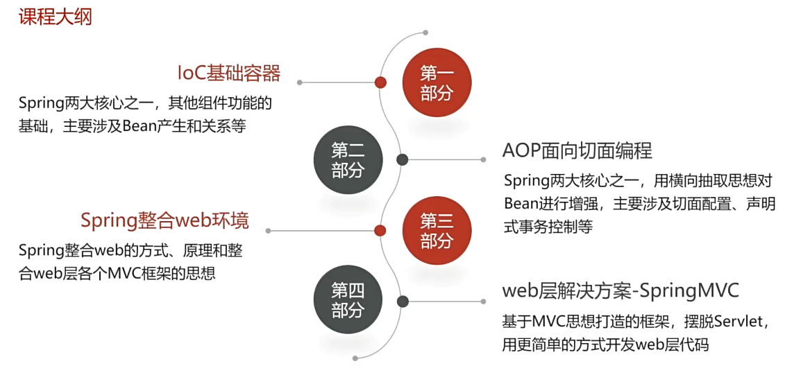

[TOC]

---

# 1 IOC容器基础

## 1.1 IOC,DI和AOP思想的提出

### 1.1.1 传统java web开发的问题

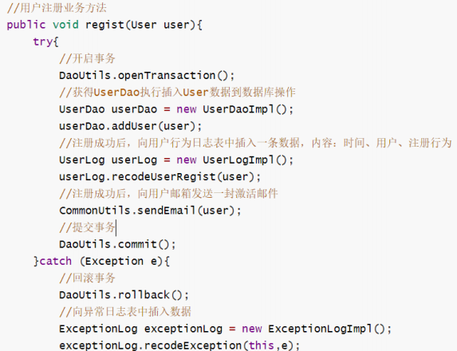

传统javaweb开发存在的问题点:

- 问题1: 层与层耦合

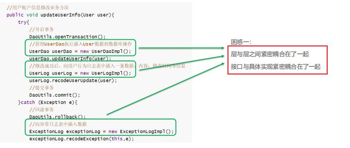

- 问题2: 通用功能代码和业务代码耦合

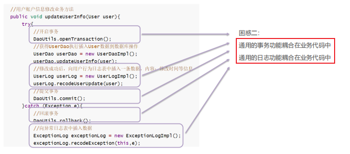

解决方式:

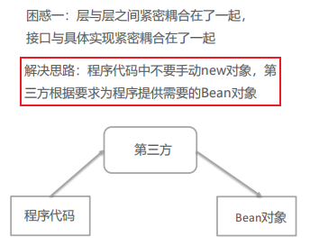

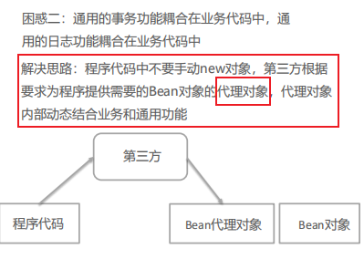

### 1.1.2 ioc,di和aop思想提出

#### 1.1.2.1 IoC控制反转

实际开发中，对象之间的耦合关系，就类似手表内部的齿轮，每个齿轮都紧密啮合在一起，一旦某个齿轮发生故障，那么整个系统也意味着崩溃。

尽可能让对象之间的关系保持**松耦合状态**是我们期望的。


ioc(inversion of control),控制反转思想,强调的是原来在程序中**创建Bean的权利反转给第三方**

举个例子:

原本程序中的`new UserServiceImpl()`手动创建.而更具IoC的思想,需要找到一个第三方去创建,需要的时候去第三方要


- 那谁去充当第三方角色呢?

工厂设计模式,定义BeanFactory来充当,产生bean的实例

- BeanFactory怎么知道产生哪些Bean实例呢？

可以使用配置文件配置Bean的基本信息，BeanFactory根据配置文件来生产Bean实例

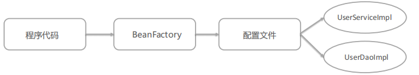


这样原本bean的创建权,反转给了BeanFactory

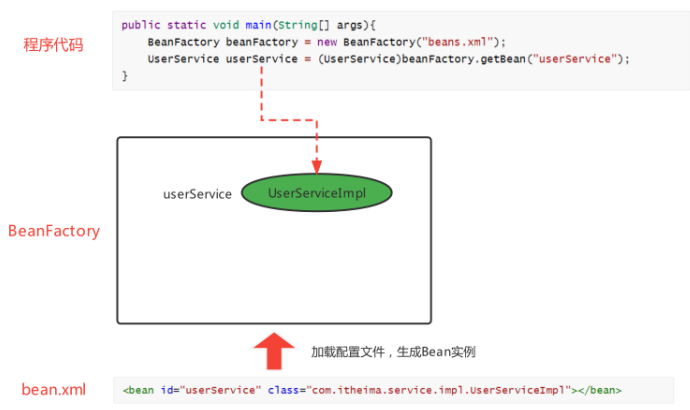


#### 1.1.2.2 DI依赖注入

上面使用BeanFactory的方式已经实现的"控制反转"，将Bean的创建权交给了BeanFactory

但是,如果我们想将UserDao的创建权也反转给BeanFactory，与此同时UserService内部还需要用到UserDao实例对象,那应该怎样操作呢？

思想:

将UserDao在BeanFactory内部设置给UserService的过程叫做“注入”，而UserService需要依赖UserDao的注入才能正常工作，这个过程叫做“依赖注入”.


#### 面试题: IoC 和 DI 的关系？

首先，先回答IoC和DI的是什么：

IoC： Inversion of Control，控制反转，将Bean的创建权由原来程序反转给第三方

DI：Dependency Injection，依赖注入，某个Bean的完整创建依赖于其他Bean（或普通参数）的注入

其次，在回答IoC和DI的关系：

第一种观点：IoC强调的是Bean创建权的反转，而DI强调的是Bean的依赖关系，认为不是一回事

第二种观点：IoC强调的是Bean创建权的反转，而DI强调的是通过注入的方式反转Bean的创建权，认为DI是IoC的其中一种实现方式

#### 1.1.2.3 AOP面向切面编程

IoC和DI思想主要是解决前面我们的问题1，问题2(通用代码与业务代码耦合)还没有解决

问题2的解决方案:

借助于IoC思想，将Bean的创建权反转给BeanFactory，而BeanFactory生产的Bean是**目标Bean的代理对象**，这样就可以在代理对象中对目标对象方法进行相应的增强。


AOP思想的提出:

- AOP，Aspect Oriented Programming，面向切面编程，是对面向对象编程OOP的升华
- OOP是纵向对同一类事物的抽象，一个对象包括静态的属性信息，包括动态的方法信息等
- 而AOP是横向的对**不同事物的抽象**，属性与属性、方法与方法、对象与对象都可以组成一个切面，而用这种思维去设计编程的方式叫做面向切面编程

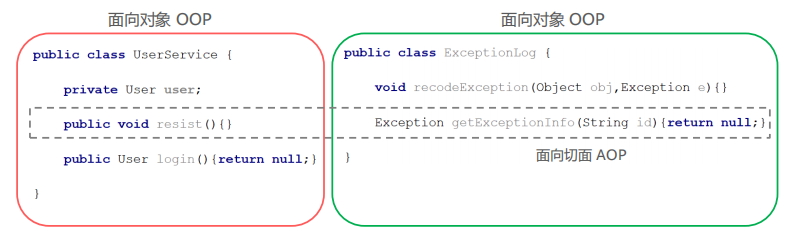

#### 1.1.2.4 小节

三种思想总结

1）IoC控制反转，是将程序创建Bean的权利反转给第三方；

2）DI依赖注入，某个完整Bean需要依赖于其他Bean（或属性）的注入；

3）AOP面向切面编程，用横向抽取方法（属性、对象等）思想，组装成一个功能性切面.

### 1.1.3 框架的概念

上面提出了一些思想来解决遇到的问题，而这些思想的实现就需要通过编码去落地，往往我们把具备一定业务领域解决方案的"工具"称为框架

框架的基本特点:

- 框架（Framework），是基于基础技术之上，从众多业务中抽取出的通用解决方案；
- 框架是一个半成品，使用框架规定的语法开发可以提高开发效率，可以用简单的代码就能完成复杂的基础业务
- 框架内部使用大量的设计模式、算法、底层代码操作技术，如反射、内省、xml解析、注解解析等；

- 框架一般都具备扩展性；
- 有了框架，我们可以将精力尽可能的投入在纯业务开发上而不用去费心技术实现以及一些辅助业务.

Java中常用的框架：

不同语言，不同领域都有属于自己的框架，使用框架开发是作为程序员的最基础的底线。Java语言中的框架，可以分为基础框架和服务框架：

- 基础框架：完成基本业务操作的框架，如MyBatis、Spring、SpringMVC、Struts2、Hibernate等

- 服务框架：特定领域的框架，一般还可以对外提供服务框架，如MQ、ES、Nacos等


### 1.1.4 思想,框架和编码的关系

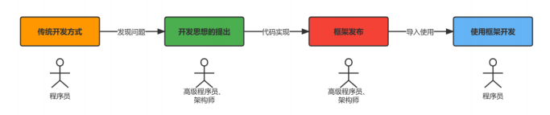

- 架构师（高级程序员）：把思想落地变为实现的人，例如上面的设计和BeanFactory的编写，即框架的设计和实现者。

- 程序员：使用框架完成业务的人，其中UserServiceImpl、beans.xml、测试类都是我们编写的


## 1.2 Spring框架

- spring是一个开源的轻量级Java开发应用框架，可以简化企业级应用开发

- spring解决了开发者在JavaEE开发中遇到的许多常见的问题，提供了功能强大IOC、AOP及Web MVC等功能。是当前企业中Java开发几乎不能缺少的框架之一
- spring的生态及其完善，不管是spring哪个领域的解决方案都是依附于在Spring Framework基础框架的

框架历史:

- Jsp 默默扛下所有；

- MVC+三层架构分工明确，但开发成本及其高；

- EJB 重量级框架出现，走出一个困境，有进入另一个困境；

- Spring 春天来到，随之，SSH风生水起、称霸武林；

- Spring 稳住江湖大哥位置，SSM开始上位；

- Spring 本着“拿来主义”的思维快速发展，生态不断健全；

- SpringBoot 又一里程碑崛起，把“约定大于配置“思想玩儿的炉火纯青；

- SpringCloud 打包了微服务众多解决方案，应对互联网项目更加easy！

技术栈:

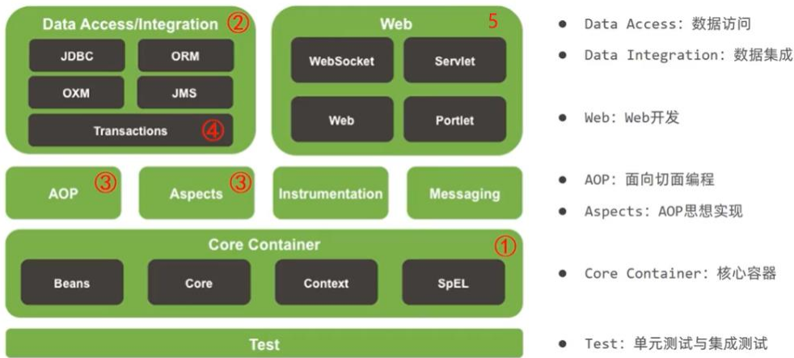


### 1.2.1 BeanFactory

分析BeanFactory的开发步骤:

Ioc控制反转:

1）导入Spring的jar包或Maven坐标；

```xml
<dependency>
  <groupId>org.springframework</groupId>
  <artifactId>spring-context</artifactId>
  <version>5.3.7</version>
</dependency>
```

2）定义UserService接口及其UserServiceImpl实现类；

3）创建beans.xml配置文件，将UserServiceImpl的信息配置到该xml中；

```xml
<?xml version="1.0" encoding="UTF-8"?>
<beans xmlns="http://www.springframework.org/schema/beans"
       xmlns:xsi="http://www.w3.org/2001/XMLSchema-instance"
       xsi:schemaLocation="http://www.springframework.org/schema/beans http://www.springframework.org/schema/beans/spring-beans.xsd">

    <bean id="userService" class="com.zigzag.ch1.ioc.service.impl.UserServiceImpl"></bean>
</beans>
```

4）编写测试代码，创建BeanFactory，加载配置文件，获取UserService实例对象。

```java
// 创建BeanFactory
DefaultListableBeanFactory beanFactory = new DefaultListableBeanFactory();
// 创建xml读取器
XmlBeanDefinitionReader xmlReader = new XmlBeanDefinitionReader(beanFactory);
// 加载xml文件
xmlReader.loadBeanDefinitions("beans.xml");
// 获取bean
UserService userService = (UserServiceImpl) beanFactory.getBean("userService");

System.out.println("userService = " + userService);
```

DI依赖注入:

1）定义UserDao接口及其UserDaoImpl实现类；

2）修改UserServiceImpl代码，添加一个setUserDao(UserDao userDao)用于接收注入的对象；

```java
public void setUserDao(UserDao userDao);
```


3）修改beans.xml配置文件，在UserDaoImpl的<bean>中嵌入<property>配置注入；

```xml

<bean id="userDao" class="com.zigzag.ch1.ioc.dao.impl.UserDaoImpl"/>

<bean id="userService" class="com.zigzag.ch1.ioc.service.impl.UserServiceImpl">
<property name="userDao" ref="userDao"/>
</bean>
```


4）修改测试代码，获得UserService时，setUserService方法执行了注入操作。

```text
userDao = com.zigzag.ch1.ioc.dao.impl.UserDaoImpl@42d3bd8b
userService = com.zigzag.ch1.ioc.service.impl.UserServiceImpl@26ba2a48
```

> 注:
>
> <property name="userDao" ref="userDao" />
>
> property依赖注入调用了setUserDao方法, `set+name`

### 1.2.2 ApplicationContext

ApplicationContext称为Spring容器,内部封装了BeanFactory

比BeanFactory功能更丰富,强大

使用ApplicationContext进行开发时,xml配置文件的名称习惯写成applicationContext.xml

```xml
ApplicationContext context = new ClassPathXmlApplicationContext("beans.xml");

UserService userService = (UserService) context.getBean("userService");
System.out.println("userService = " + userService);
```

#### 1.2.2.1 BeanFactory和ApplcationContext的关系

1. BeanFactory是Spring的早期接口，称为Spring的Bean工厂，ApplicationContext是后期更高级接口，称之为Spring 容器；

2. ApplicationContext在BeanFactory基础上对功能进行了扩展，例如：监听功能、国际化功能等。BeanFactory的API更偏向底层，ApplicationContext的API大多数是对这些底层API的封装；

3. Bean创建的主要逻辑和功能都被封装在BeanFactory中，ApplicationContext不仅继承了BeanFactory，而且

   ApplicationContext内部还维护着BeanFactory的引用，所以，ApplicationContext与BeanFactory既有继承关系，又有融合关系。

4. **Bean的初始化时机不同**，原始BeanFactory是在首次调用getBean时才进行Bean的创建(<u>延迟加载</u>)，而ApplicationContext则是配置文件加载，容器一创建就将Bean都实例化并初始化好


ApplcationContext除了了继承了BeanFactory外，还继承了ApplicationEventPublisher（事件发布器）、ResouresPatternResolver（资源解析器）、MessageSource（消息资源）等。

但是ApplicationContext的核心功能还是BeanFactory

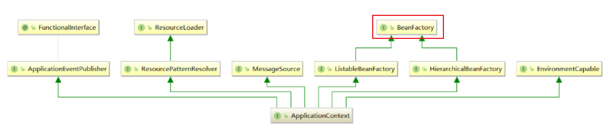


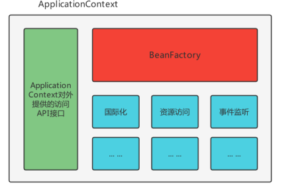

#### 1.2.2.2 BeanFactory和ApplicationContext的继承体系

- BeanFactory

BeanFactory是核心接口，项目运行过程中肯定有具体实现参与，这个具体实现就是DefaultListableBeanFactory，而ApplicationContext内部维护的Beanfactory的实现类也是它

ApplicationContext内部的BeanFactory实现类:

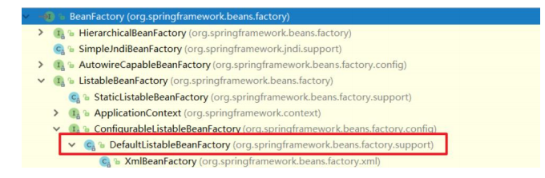

- ApplicationContext

只在Spring基础环境下，即只导入spring-context坐标时，此时ApplicationContext的继承体系:

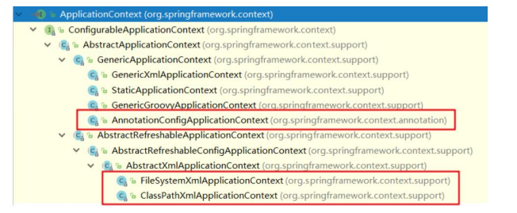

只在Spring基础环境下，常用的三个ApplicationContext作用如下：

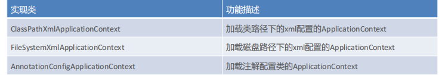

如果Spring基础环境中加入了其他组件解决方案，如web层解决方案，即导入spring-web坐标，此时ApplicationContext的继承体系:

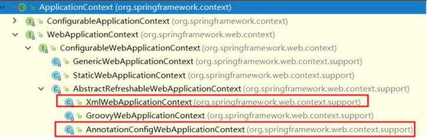

在Spring的web环境下，常用的两个ApplicationContext作用如下：

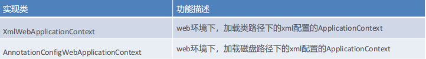


---


## 1.3 基于xml的spring应用

### 1.3.1 Spring Bean的配置详解

spring开发中主要是对bean的配置,常用配置有:

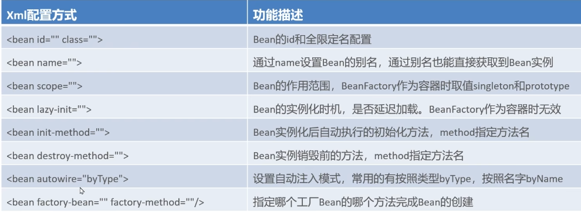

#### 1.3.1.1 Bean的基本配置

```xml

<bean id="userDao" class="com.zigzag.ch1.ioc.dao.impl.UserDaoImpl"/>
```

此时存储到Spring容器（singleObjects单例池）中的Bean的beanName是userDao，值是UserDaoImpl对象，可以根据beanName获取Bean实例

- 在没有指定name的情况下,会将id转换成name
- 在没有配置id的情况下,spring会把当前bean实力的全限定名作为beanName

#### 1.3.1.2 Bean的别名配置

```xml

<bean id="userService" name="aaa,bbb" class="com.zigzag.ch1.ioc.service.impl.UserServiceImpl">
```

可以为当前Bean指定多个别名，根据别名也可以获得Bean对象

- 多个别名都可以获取实例对象

#### 1.3.1.3 Bean的范围配置

默认情况下，单纯的Spring环境Bean的作用范围有两个：Singleton和Prototype

- **singleton**：单例，默认值，Spring容器创建的时候，就会进行Bean的实例化，并存储到容器内部的单例池`singletonObjects`中，每次getBean时都是从单例池中获取相同的Bean实例；
- **prototype**：原型，Spring容器初始化时不会创建Bean实例，会保存信息至`beanDefinitionMap`中,当调用getBean时才会实例化Bean，每次getBean都会创建一个新的Bean实例

实验:

单例:

```xml

<bean id="userService" name="aaa,bbb" class="com.zigzag.ch1.ioc.service.impl.UserServiceImpl" scope="singleton"/>
```

```java
UserService userService = (UserService) context.getBean("userService");
UserService userService2 = (UserService) context.getBean("userService");
System.out.println(userService == userService2);  // true
```

原型:

```xml

<bean id="userService" name="aaa,bbb" class="com.zigzag.ch1.ioc.service.impl.UserServiceImpl" scope="prototype"/>
```

```xml
System.out.println(userService == userService2);  // false
```

#### 1.3.1.4 延迟加载

当lazy-init设置为true时为延迟加载，也就是当Spring容器创建的时候，不会立即创建Bean实例，等待用到时在创建Bean实例并存储到单例池中去，后续在使用该Bean直接从单例池获取即可，本质上该Bean还是单例的

```xml

<bean id="userDao" class="com.zigzag.ch1.ioc.dao.impl.UserDaoImpl" lazy-init="true"/>
```

#### 1.3.1.5 Bean的初始化和销毁方法配置

Bean在被实例化后，可以执行指定的初始化方法完成一些初始化的操作，

Bean在销毁之前也可以执行指定的销毁方法完成一些操作，初始化方法名称和销毁方法名称通过

```java
public class UserDaoImpl implements UserDao {

  public void init() {
    System.out.println("初始化方法");
  }

  public void destroy() {
    System.out.println("销毁方法");
  }
}
```

xml中配置:

```xml

<bean id="userDao" class="com.zigzag.ch1.ioc.dao.impl.UserDaoImpl" init-method="init" destroy-method="destroy"/>
```

拓展:

除此之外,我们还可以通过实现 `InitializingBean `接口，完成一些Bean的初始化操作:

```java
public class UserDaoImpl implements UserDao, InitializingBean {

  public void init() {
    System.out.println("初始化方法");
  }

  public void destroy() {
    System.out.println("销毁方法");
  }

  @Override
  public void afterPropertiesSet() throws Exception {
    System.out.println("执行时机早于 init-method");
  }
}
```


#### 1.3.1.6 bean的实例化配置

Spring的实例化方式主要如下两种：

- 构造方式实例化：底层通过构造方法对Bean进行实例化
- 工厂方式实例化：底层通过调用自定义的工厂方法对Bean进行实例化

构造方式实例化Bean又分为无参构造方法实例化和有参构造方法实例化，Spring中配置的`<bean>`几乎都是无参构造该方式,不需要额外配置,

**有参构造方法**实例化Bean实验如下:

```java
public UserDaoImpl(String name) {
  this.name = name;
}
```

有参构造在实例化Bean时，需要参数的注入，通过`<constructor-arg>`标签，嵌入在<bean>标签内部提供构造参

数:

```java
<bean id="userDao" class="com.zigzag.ch1.ioc.dao.impl.UserDaoImpl">
  <constructor-arg name="name" value="haohao" />
</bean>
```

**工厂方式**实例化Bean，又分为如下三种：


- 静态工厂方法实例化Bean

静态工厂方法实例化Bean，其实就是定义一个工厂类，提供一个静态方法用于生产Bean实例，在将该工厂类及其静态方法配置给Spring即可

```java
public class UserDaoBeanFactory {
  // 静态工厂方法
  public static UserDao getUserDao(String name) {
    return new UserDaoImpl(name);
  }
}
```

```xml

<bean id="userDao" class="com.zigzag.ch1.ioc.UserDaoBeanFactory" factory-method="getUserDao">
    <constructor-arg name="name" value="haohao"/>
</bean>
```

> 注:
>
> <constructor-arg>标签不仅仅是为构造方法传递参数，只要是为了实例化对象而传递的参数都可以通过<constructor-arg>标签完成，例如上面通过静态工厂方法实例化Bean所传递的参数也是要通过<constructor-arg>进行传递的


- 实例工厂方法实例化Bean

实例工厂方法，也就是非静态工厂方法产生Bean实例，与静态工厂方式比较，该方式需要先有工厂对象，在用工厂对象去调用非静态方法，所以在进行配置时，要先配置工厂Bean，在配置目标Bean

```xml

<bean id="userDaoBeanFactory" class="com.zigzag.ch1.ioc.UserDaoBeanFactory"/>

<bean id="userDao" factory-bean="userDaoBeanFactory" factory-method="getUserDao">
<constructor-arg name="name" value="haohao"/>
</bean>
```


- 实现FactoryBean规范延迟实例化Bean

上面不管是静态工厂方式还是非静态工厂方式，都是自定义的工厂方法，

Spring提供了FactoryBean的接口规范，FactoryBean接口定义如下：

```java
// spring的bean工厂规范
public interface FactoryBean<T> {
  String OBJECT_TYPE_ATTRIBUTE = "factoryBeanObjectType";

  @Nullable
  T getObject() throws Exception; // 获取对象实例

  @Nullable
  Class<?> getObjectType(); // 获取对象类型方法

  default boolean isSingleton() {
    return true;
  }
}
```


实现FactoryBean定义bean工厂:

```java
public class UserDaoBeanFactory implements FactoryBean<UserDao> {
  @Override
  public UserDao getObject() throws Exception {
    return new UserDaoImpl();
  }

  @Override
  public Class<?> getObjectType() {
    return UserDao.class;
  }
}
```

交由spring管理:

```xml

<bean id="userDao" class="com.zigzag.ch1.ioc.UserDaoBeanFactory"/>
```

分析:

通过断点观察发现Spring容器创建时，FactoryBean被实例化了，并存储到了单例池singletonObjects中，但是getObject() 方法尚未被执行，UserDaoImpl也没被实例化，

当首次用到UserDaoImpl时，才调用getObject() ，

此工厂方式产生的Bean实例*不会存储到单例池*singletonObjects中，会存储到 `factoryBeanObjectCache` 缓存池中，并且后期每次使用到userDao都从该缓存池中返回的是同一个userDao实例。


#### 1.3.1.7 Bean的依赖注入配置

Bean的依赖注入有两种方式：

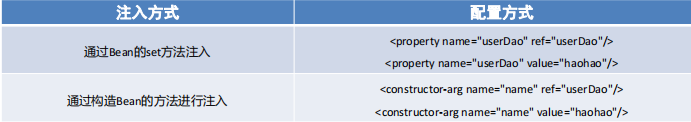

其中，ref 是 reference 的缩写形式，翻译为：涉及，参考的意思，用于引用其他Bean的id; value 用于注入普通属性值

依赖注入的数据类型有如下三种：

- 普通数据类型，例如：String、int、boolean等，通过value属性指定。

- 引用数据类型，例如：UserDaoImpl、DataSource等，通过ref属性指定。

- 集合数据类型，例如：List、Map、Properties等如下:

注入 List<T> 集合 – 普通数据:

```java
public void setStrList(List<String> strList) {
  strList.forEach(System.out::println);
}
```

```xml

<bean id="userDao" class="com.zigzag.ch1.ioc.dao.impl.UserDaoImpl">
    <property name="strList">
        <list>
            <value>haohao</value>
            <value>miaomiao</value>
        </list>
    </property>
</bean>
```

注入 List<T> 集合 – 引用数据:

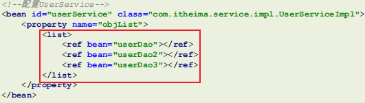

注入Set<T>集合:

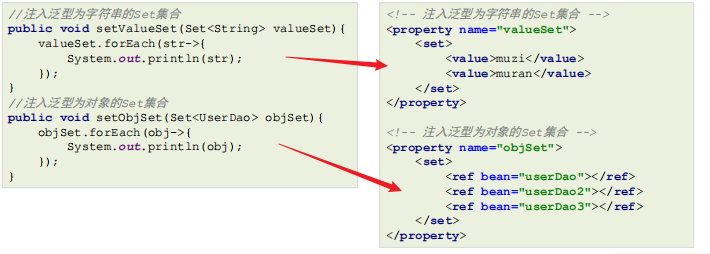

注入 Map<K,V> 集合:

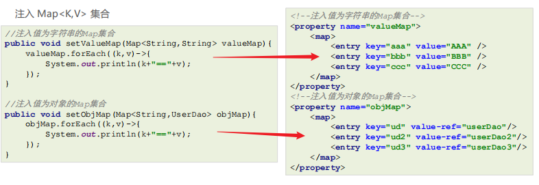

注入 Properties 键值对:

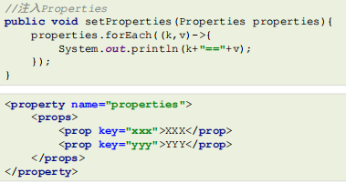

> 注:
>
> 拓展:自动装配方式
>
> 如果被注入的属性类型是Bean引用的话，那么可以在<bean> 标签中使用 autowire 属性去配置自动注入方式，属性值有两个：
>
> - byName：通过属性名自动装配，即去匹配 setXxx 与 id="xxx"（name="xxx"）是否一致；
> - byType：通过Bean的类型从容器中匹配，匹配出多个相同Bean类型时，报错。
>
> ```xml
> <bean id="userService" class="com.itheima.service.impl.UserServiceImpl" 
> autowire="byType">
> ```


#### 1.3.1.8 spring的其他配置标签

Spring 的 xml 标签大体上分为两类，一种是默认标签，一种是自定义标签

- 默认标签：就是不用额外导入其他命名空间约束的标签，例如 <bean> 标签
- 自定义标签：就是需要额外引入其他命名空间约束，并通过前缀引用的标签，例如 <context:property-placeholder/> 标签

Spring的默认标签用到的是Spring的默认命名空间

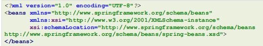

该命名空间约束下的默认标签如下：

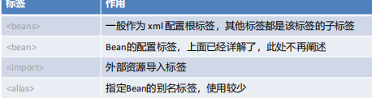

- <beans>标签，除了经常用的做为根标签外，还可以嵌套在根标签内，使用profile属性切换开发环境

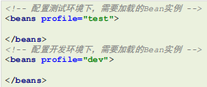

可以使用以下两种方式指定被激活的环境：

1. 使用命令行动态参数，虚拟机参数位置加载 -Dspring.profiles.active=test
2. 使用代码的方式设置环境变量 System.setProperty("spring.profiles.active","test")


- <import>标签，用于导入其他配置文件，项目变大后，就会导致一个配置文件内容过多，可以将一个配置文件根据业务某块进行拆分，拆分后，最终通过<import>标签导入到一个主配置文件中，项目加载主配置文件就连同<import> 导入的文件一并加载了

```xml
<!--导入用户模块配置文件-->
<import resource="classpath:UserModuleApplicationContext.xml"/>
<!--导入商品模块配置文件-->
<import resource="classpath:ProductModuleApplicationContext.xml"/>
```


- <alias> 标签是为某个Bean添加别名，与在<bean> 标签上使用name属性添加别名的方式一样，我们为UserServiceImpl指定四个别名：aaa、bbb、xxx、yyy

```xml
<!--配置UserService-->
<bean id="userService" name="aaa,bbb" class="com.itheima.service.impl.UserServiceImpl">
<property name="userDao" ref="userDao"/>
</bean>

<!--指定别名-->
<alias name="userService" alias="xxx"/>
<alias name="userService" alias="yyy"/>
```

分析: 断点调试，在beanFactory中维护着一个名为aliasMap的Map<String,String>集合，存储别名和beanName之间的映射关系

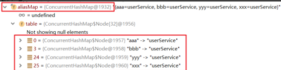


- Spring的自定义标签需要引入外部的命名空间，并为外部的命名空间指定前缀，使用 <前缀:标签> 形式的标签，称之为自定义标签，自定义标签的解析流程也是 Spring xml扩展点方式之一，

  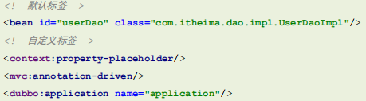


### 1.3.2 Spring的getBean方法

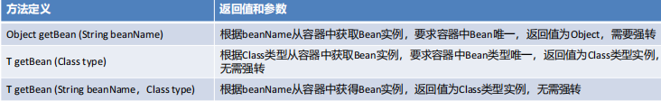

```java
//根据beanName获取容器中的Bean实例，需要手动强转
UserService userService = (UserService) applicationContext.getBean("userService");
//根据Bean类型去容器中匹配对应的Bean实例，如存在多个匹配Bean则报错
UserService userService2 = applicationContext.getBean(UserService.class);
//根据beanName获取容器中的Bean实例，指定Bean的Type类型
UserService userService3 = applicationContext.getBean("userService", 
UserService.class);
```


### 1.3.3 Spring配置非自定义bean

以上在 xml 中配置的Bean都是自己定义的，例如：UserDaoImpl，UserServiceImpl。

但是，在实际开发中有些功能类并不是我们自己定义的，而是使用的*第三方jar包*中的，那么，这些Bean要想让Spring进行管理，也需要对其进行配置

配置非自定义的Bean需要考虑如下两个问题：

- 被配置的Bean的实例化方式是什么？无参构造、有参构造、静态工厂方式还是实例工厂方式；
- 被配置的Bean是否需要注入必要属性。


实践:

#### 1.3.3.1 配置 Druid 数据源交由Spring管理

1. 配置 DruidDataSource

```xml
<!-- mysql驱动 -->
<dependency>
  <groupId>mysql</groupId>
  <artifactId>mysql-connector-java</artifactId>
  <version>5.1.49</version>
</dependency>
<!-- druid数据源 -->
<dependency>
  <groupId>com.alibaba</groupId>
  <artifactId>druid</artifactId>
  <version>1.1.23</version>
</dependency>
```

```xml
<!--配置 DruidDataSource数据源-->
<bean class="com.alibaba.druid.pool.DruidDataSource">
  <!--配置必要属性-->
  <property name="driverClassName" value="com.mysql.jdbc.Driver"/>
  <property name="url" value="jdbc://localhost:3306/mybatis"/>
  <property name="username" value="root"/>
  <property name="password" value="root"/>
</bean>
```


2. 配置Connection交由Spring管理

Connection 的产生是通过DriverManager的静态方法getConnection获取的，所以我们要用静态工厂方式配置

```xml
<bean class="java.lang.Class" factory-method="forName">
  <constructor-arg name="className" value="com.mysql.jdbc.Driver"/>
</bean>
```

```xml
<bean id="connection" class="java.sql.DriverManager" factory-method="getConnection" 
scope="prototype">
  <constructor-arg name="url" value="jdbc:mysql:///mybatis"/>
  <constructor-arg name="user" value="root"/>
  <constructor-arg name="password" value="root"/>
</bean>
```


3. 配置日期对象交由Spring管理

产生一个指定日期格式的对象，原始代码按如下：

```java
String currentTimeStr = "2023-08-27 07:20:00";
SimpleDateFormat simpleDateFormat = new SimpleDateFormat("yyyy-MM-dd HH:mm:ss");
Date date = simpleDateFormat.parse(currentTimeStr);
```

可以看成是实例工厂方式，使用Spring配置方式产生Date实例:

```xml
<bean id="simpleDateFormat" class="java.text.SimpleDateFormat">
  <constructor-arg name="pattern" value="yyyy-MM-dd HH:mm:ss"/>
</bean>
<bean id="date" factory-bean="simpleDateFormat" factory-method="parse">
  <constructor-arg name="source" value="2023-08-27 07:20:00"/>
</bean>
```


4. 配置Mybatis的SqlSessionFactory交由Spring管理

```xml
<!--mybatis框架-->
<dependency>
  <groupId>org.mybatis</groupId>
  <artifactId>mybatis</artifactId>
  <version>3.5.5</version>
</dependency>
<!-- mysql驱动 -->
<dependency>
  <groupId>mysql</groupId>
  <artifactId>mysql-connector-java</artifactId>
  <version>5.1.49</version>
</dependency>
```

MyBatis原始获得SqlSessionFactory的方式：

```java
//加载mybatis核心配置文件，使用Spring静态工厂方式
InputStream in = Resources.getResourceAsStream(“mybatis-conifg.xml”);
//创建SqlSessionFactoryBuilder对象，使用Spring无参构造方式
SqlSessionFactoryBuilder builder = new SqlSessionFactoryBuilder();
//调用SqlSessionFactoryBuilder的build方法，使用Spring实例工厂方式
SqlSessionFactory sqlSessionFactory = builder.build(in);
```

SqlSessionFactory交由Spring管理配置如下：

```xml
<!--静态工厂方式产生Bean实例-->
<bean id="inputStream" class="org.apache.ibatis.io.Resources" factory-method="getResourceAsStream">
  <constructor-arg name="resource" value="mybatis-config.xml"/>
</bean>

<!--无参构造方式产生Bean实例-->
<bean id="sqlSessionFactoryBuilder" class="org.apache.ibatis.session.SqlSessionFactoryBuilder"/>

<!--实例工厂方式产生Bean实例-->
<bean id="sqlSessionFactory" factory-bean="sqlSessionFactoryBuilder" factory-method="build">
  <constructor-arg name="inputStream" ref="inputStream"/>
</bean>
```


### 1.3.4 Bean实例化的基本流程

Spring容器在进行初始化时,会将xml配置的`<bean>`的信息封装成一个`BeanDefinition`对象,所有的BeanDefinition存储到一个名为`beanDefinitionMap`的Map集合中去

Spring框架再对该Map进行遍历,使用反射创建Bean实例对象,创建好的bean对象存储在一个名为`singletonObjects`的Map集合中,当调用getBean方法时则最终从该Map集合中取出bean实例对象返回

BeanDefinition与xml中bean的对应关系:


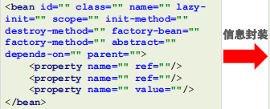 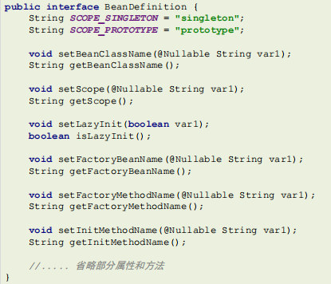


`DefaultListableBeanFactory`对象内部维护着一个Map用于存储封装好的BeanDefinitionMap

```java
public class DefaultListableBeanFactory extends ... implements ... {
  //存储<bean>标签对应的BeanDefinition对象
  //key:是Bean的beanName，value:是Bean定义对象BeanDefinition
  private final Map<String, BeanDefinition> beanDefinitionMap;
}
```

Spring框架会取出beanDefinitionMap中的每个BeanDefinition信息，反射构造方法或调用指定的工厂方法生成Bean实例对象，所以只要将BeanDefinition注册到beanDefinitionMa这个Map中，Spring就会进行对应的ean的实例化操作

Bean实例及单例池singletonObjects， beanDefinitionMap中的BeanDefinition会被转化成对应的Bean实例对象，存储到单例池singletonObjects中去，在`DefaultListableBeanFactory的上四级父类DefaultSingletonBeanRegistry`中，维护着singletonObjects，源码如下:

```java
public class DefaultSingletonBeanRegistry extends ... implements ... {
  //存储Bean实例的单例池
  ////key:是Bean的beanName，value:是Bean的实例对象
  private final Map<String, Object> singletonObjects = new ConcurrentHashMap(256);
}
```

基本流程梳理:

- 加载xml配置文件,解析获取配置中每个`<bean>`的形象,封装成BeanDefinition对象
- 将BeanDefinition存储在一个名为beanDefinitionMap的Map<String, BeanDefinition>中
- ApplicationContext底层遍历BeanDefinitionMap,创建Bean实力对象
- 创建好的Bean实例对象,被存储到一个名为singletonObjects的Map<String, Object>中
- 当执行applicationContext.getBean(beanName)时,从singletonObjects去匹配Bean实例返回


图示:

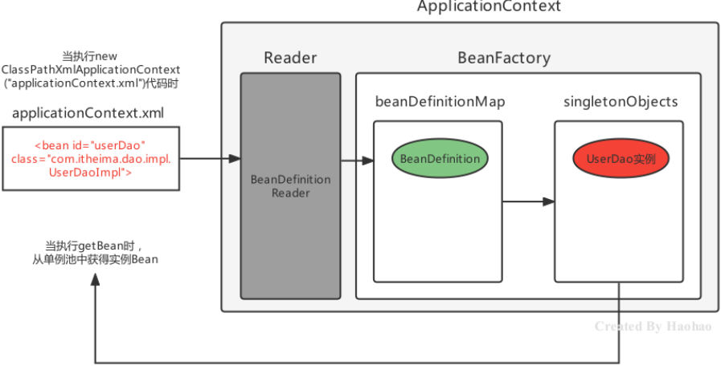


## 1.4 Spring的后处理器

Spring的后处理器是Spring对外开发的重要扩展点，允许我们介入到Bean的整个实例化流程中来，以达到动态注册BeanDefinition，动态修改BeanDefinition，以及动态修改Bean的作用.

Spring主要有两种后处理器：

- BeanFactoryPostProcessor：Bean工厂后处理器，在BeanDefinitionMap填充完毕，Bean实例化之前执行；
- BeanPostProcessor：Bean后处理器，一般在Bean实例化之后，填充到单例池singletonObjects之前执行。

### 1.4.1 BeanFactoryPostProcessor

BeanFactoryPostProcessor是一个接口规范，实现了该接口的类只要交由Spring容器管理的话，那么Spring就会回调该接口的方法，用于对BeanDefinition注册和修改的功能

```java
public class MyBeanFactoryPostProcessor implements BeanFactoryPostProcessor {
  @Override
  public void postProcessBeanFactory(ConfigurableListableBeanFactory configurableListableBeanFactory) throws BeansException {
    System.out.println("MyBeanFactoryPostProcessor执行了");
  }
}
```

```xml

<bean class="com.zigzag.ch1.ioc.processor.MyBeanFactoryPostProcessor"/>
```

postProcessBeanFactory 参数本质就是 DefaultListableBeanFactory,拿到BeanFactory的引用，自然就可以对beanDefinitionMap中的BeanDefinition进行操作了,

例如对UserDaoImpl的BeanDefinition进行修改操作:

```java
public class MyBeanFactoryPostProcessor implements BeanFactoryPostProcessor {
  public void postProcessBeanFactory(ConfigurableListableBeanFactory beanFactory) 
    throws BeansException {
    BeanDefinition userDaoBD = beanFactory.getBeanDefinition(“userDao”);//获得UserDao定义对象
    userDaoBD.setBeanClassName("com.itheima.dao.impl.UserDaoImpl2"); //修改class
    //userDaoBD.setInitMethodName(methodName); //修改初始化方法
    //userDaoBD.setLazyInit(true); //修改是否懒加载
    //... 省略其他的设置方式 ...
  }
}
```

例如还可以对注册一个BeanDefinition

```java
public class MyBeanFactoryPostProcessor implements BeanFactoryPostProcessor {
  @Override
  public void postProcessBeanFactory(ConfigurableListableBeanFactory beanFactory) throws BeansException {

    // 将ConfigurableListableBeanFactory强转成子类DefaultListableBeanFactory
    // DefaultListableBeanFactory具有往BeanDefinitionMap中存入数据的方法
    if (beanFactory instanceof DefaultListableBeanFactory) {
      DefaultListableBeanFactory defaultListableBeanFactory = (DefaultListableBeanFactory)
        beanFactory;
      // 动态注册PersonDaoImpl,存入BeanDefinitionMap
      RootBeanDefinition beanDefinition = new RootBeanDefinition();
      beanDefinition.setBeanClassName("com.zigzag.ch1.ioc.dao.impl.PersonDaoImpl");
      defaultListableBeanFactory.registerBeanDefinition("personDao", beanDefinition);
    }
  }
}
```

实际上,Spring提供了一个BeanFactoryPostProcessor的子接口`BeanDefinitionRegistryPostProcessor`专门用于注册BeanDefinition的操作

```java
/**
 * BeanDefinitionRegistryPostProcessor,
 * BeanFactoryPostProcessor子接口,专门用于注册BeanDefinition
 *
 * @author qlk
 */
public class MyBeanFactoryPostProcessor2 implements BeanDefinitionRegistryPostProcessor {
  @Override
  public void postProcessBeanDefinitionRegistry(BeanDefinitionRegistry registry) throws BeansException {
    RootBeanDefinition beanDefinition = new RootBeanDefinition();
    beanDefinition.setBeanClassName("com.zigzag.ch1.ioc.dao.impl.PersonDaoImpl2");
    registry.registerBeanDefinition("personDao2", beanDefinition);
  }

  @Override
  public void postProcessBeanFactory(ConfigurableListableBeanFactory beanFactory) throws BeansException {

  }
}
```

```xml

<bean class="com.zigzag.ch1.ioc.processor.MyBeanFactoryPostProcessor2"/>
```

综上,比较完整的bean注册流程如下:

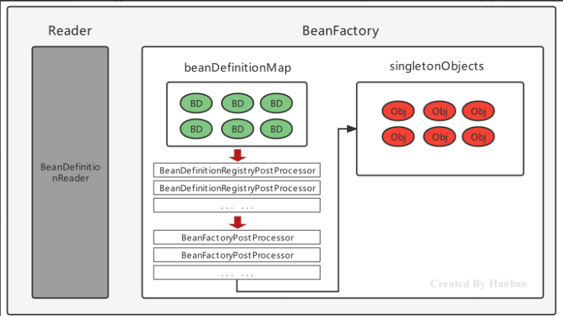

BeanFactoryPostProcessor 在SpringBean的实例化过程中的体现在beanDefinitionMap到singletonObjects

### 1.4.2 案例:使用bean工厂后处理器+注解,完成自定义注解扫描

要求如下：

- 自定义@MyComponent注解，使用在类上；

- 使用资料中提供好的包扫描器工具BaseClassScanUtils 完成指定包的类扫描；

- 自定义BeanFactoryPostProcessor完成注解@MyComponent的解析，解析后最终被Spring管理。

编码:

1. 扫描包下所有类的注解信息

```java
public class BaseClassScanUtils {

    //设置资源规则
    private static final String RESOURCE_PATTERN = "/**/*.class";

    public static Map<String, Class> scanMyComponentAnnotation(String basePackage) {

        //创建容器存储使用了指定注解的Bean字节码对象
        Map<String, Class> annotationClassMap = new HashMap<String, Class>();

        //spring工具类，可以获取指定路径下的全部类
        ResourcePatternResolver resourcePatternResolver = new PathMatchingResourcePatternResolver();
        try {
            String pattern = ResourcePatternResolver.CLASSPATH_ALL_URL_PREFIX +
                    ClassUtils.convertClassNameToResourcePath(basePackage) + RESOURCE_PATTERN;
            Resource[] resources = resourcePatternResolver.getResources(pattern);
            //MetadataReader 的工厂类
            MetadataReaderFactory refractory = new CachingMetadataReaderFactory(resourcePatternResolver);
            for (Resource resource : resources) {
                //用于读取类信息
                MetadataReader reader = refractory.getMetadataReader(resource);
                //扫描到的class
                String classname = reader.getClassMetadata().getClassName();
                Class<?> clazz = Class.forName(classname);
                //判断是否属于指定的注解类型
                if(clazz.isAnnotationPresent(MyComponent.class)){
                    //获得注解对象
                    MyComponent annotation = clazz.getAnnotation(MyComponent.class);
                    //获得属value属性值
                    String beanName = annotation.value();
                    //判断是否为""
                    if(beanName!=null&&!beanName.equals("")){
                        //存储到Map中去
                        annotationClassMap.put(beanName,clazz);
                        continue;
                    }

                    //如果没有为"",那就把当前类的类名作为beanName
                    annotationClassMap.put(clazz.getSimpleName(),clazz);

                }
            }
        } catch (Exception exception) {
        }

        return annotationClassMap;
    }

    public static void main(String[] args) {
        Map<String, Class> stringClassMap = scanMyComponentAnnotation("com.zigzag.ch1.ioc");
        System.out.println(stringClassMap);
    }
}
```


2 自定义@MyComponnet注解

```java
@Target(ElementType.TYPE)
@Retention(RetentionPolicy.RUNTIME)
public @interface MyComponent {

    // 指定beanName
    String value() default "";
}
```

3 自定义BeanFactoryPostprocessor注册BeanDefinition

```java
public class MyComponentBeanFactoryPostProcessor implements BeanDefinitionRegistryPostProcessor {
    @Override
    public void postProcessBeanDefinitionRegistry(BeanDefinitionRegistry registry) throws BeansException {
        // 指定要扫描的包
        String packageName = "com.zigzag.ch1.ioc";
        // 调用工具类,扫描@MyComponent注解的类进行注册
        Map<String, Class> myComponentClassMap = BaseClassScanUtils.scanMyComponentAnnotation(packageName);
        // 遍历这个map,创建BeanDefinition对象进行注册
        myComponentClassMap.forEach((beanName, clazz) -> {
            RootBeanDefinition beanDefinition = new RootBeanDefinition();
            beanDefinition.setBeanClassName(clazz.getName());
            try {
                registry.registerBeanDefinition(beanName, beanDefinition);
            } catch (BeanDefinitionStoreException e) {
                e.printStackTrace();
            }
        });
    }

    @Override
    public void postProcessBeanFactory(ConfigurableListableBeanFactory beanFactory) throws BeansException {

    }
}
```

4. 注册bean

```xml

<bean class="com.zigzag.ch1.ioc.processor.MyComponentBeanFactoryPostProcessor"/>
```

结果: 

```java
TestBean testBean = (TestBean) context.getBean("TestBean");
System.out.println("testBean = " + testBean);
```


---

### 1.4.3 BeanPostProcessor

Bean被实例化后，到最终缓存到名为singletonObjects单例池之前，中间会经过Bean的初始化过程

例如:

- 属性的填充
- 初始化方法等

其中有一个对外进行扩展的点BeanPostProcessor，我们称为Bean后处理器

跟上面的Bean工厂后处理器相似，它也是一个接口，实现了该接口并被容器管理的BeanPostProcessor，会在流程节点上被Spring自动调用

`BeanPostProcessor`的接口定义如下:

```java
public interface BeanPostProcessor {
  // 在属性注入完毕,init初始化方法执行之前被回调
  @Nullable
  default Object postProcessBeforeInitialization(Object bean, String beanName) throws BeansException {
    return bean;
  }
  
  // 在初始化方法执行之后,被添加到单例池singletonObjects之前被回调
  @Nullable
  default Object postProcessAfterInitialization(Object bean, String beanName) throws BeansException {
    return bean;
  }
}
```

自定义MyBeanPostProcessor，

```java
public class MyBeanPostProcessor implements BeanPostProcessor {

  /**
     * 参数： bean是当前被实例化的Bean，beanName是当前Bean实例在容器中的名称
     * 返回值：当前Bean实例对象
     * 属性注入完成,初始化方法之前
     */
  @Override
  public Object postProcessBeforeInitialization(Object bean, String beanName) throws BeansException {
    // 此处可以给bean注入属性值
    if (bean instanceof UserDaoImpl) {
      UserDaoImpl userDao = (UserDaoImpl) bean;
      userDao.setName("好好");
    }
    System.out.println(beanName + ":postProcessBeforeInitialization");
    return bean;
  }

  /**
     * 参数： bean是当前被实例化的Bean，beanName是当前Bean实例在容器中的名称
     * 返回值：当前Bean实例对象
     * 在初始化方法执行之后
     */
  @Override
  public Object postProcessAfterInitialization(Object bean, String beanName) throws BeansException {
    System.out.println(beanName + ":postProcessAfterInitialization");
    return bean;
  }
}
```

BeanPostProcessor方法执行位置:

```java
public class UserDaoImpl implements UserDao, InitializingBean {

  private String name;

  public UserDaoImpl() {
    System.out.println("UserDaoImpl无参初始化方法");
  }

  public UserDaoImpl(String name) {
    System.out.println("UserDaoImpl有参初始化方法");
    this.name = name;
  }

  public void setName(String name) {
    this.name = name;
  }

  public void init() {
    System.out.println("init初始化方法");
  }

  public void destroy() {
    System.out.println("销毁方法");
  }

  @Override
  public void afterPropertiesSet() throws Exception {
    System.out.println("执行时机早于 init-method,afterPropertiesSet:属性注入后执行");
  }

  // 对应set方法,为strList注入值
  public void setStrList(List<String> strList) {
    strList.forEach(System.out::println);
  }
}
```

```xml
<bean id="userDao" class="com.zigzag.ch1.ioc.dao.impl.UserDaoImpl" init-method="init">
  <property name="name" value="坏坏" />
</bean>
```

结果:

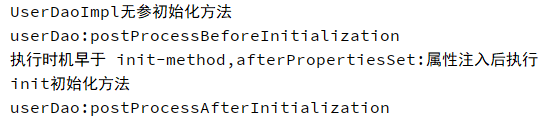

- 先构造器方法
- 执行postProcessBeforeInitialization
- 实现InitializingBean后的afterPropertiesSet()方法
- 指定的初始化方法
- 最后执行postProcessAfterInitialization

在`BeanPostProcessor`的两个方法中,可以执行afterPropertiesSet和初始化方法

---

综上,加入bean后处理器的bean注册图示:

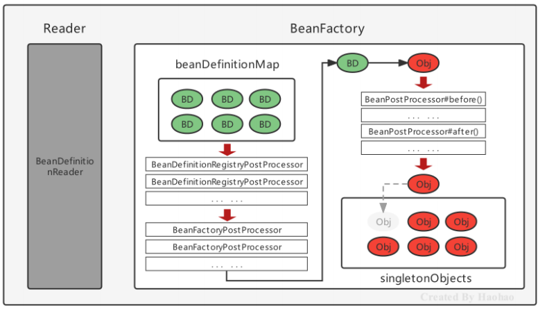

BeanPostProcessor 在 SpringBean

的实例化过程中的体现

### 1.4.4 案例,使用bean后处理器实现执行时间日志增强

要求如下：

- Bean的方法执行之前控制台打印当前时间；

- Bean的方法执行之后控制台打印当前时间

分析:

- 对方法进行增强主要就是代理设计模式和包装设计模式；

- 由于Bean方法不确定，所以使用动态代理在运行期间执行增强操作；

- 在Bean实例创建完毕后，进入到单例池之前，使用Proxy代替真是的目标Bean

编码:

1. bean进入sigletonObjects前,使用代码对bean的方法进行增强

```java
public class TimeLogBeanPostProcessor implements BeanPostProcessor {
  @Override
  public Object postProcessAfterInitialization(Object bean, String beanName) throws BeansException {
    System.out.println("TimeLogBeanPostProcessor:postProcessAfterInitialization");

    //对Bean进行动态代理，返回的是Proxy代理对象
    Object proxyBean = Proxy.newProxyInstance(
      bean.getClass().getClassLoader(),
      bean.getClass().getInterfaces(),
      (Object proxy, Method method, Object[] args) -> {
        long start = System.currentTimeMillis();
        System.out.println("开始时间：" + new Date(start));
        //执行目标方法
        Object result = method.invoke(bean, args);
        long end = System.currentTimeMillis();
        System.out.println("结束时间：" + new Date(end));
        return result;
      });

    //返回代理对象,注入到单例对象池
    return proxyBean;
  }
}
```

进入sigletonObjects的对象是增强后的代理对象:

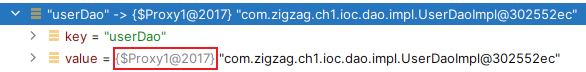

2. 调用

```java
UserDao userDao = (UserDao) context.getBean("userDao");
userDao.showTimeLog();
```

结果:

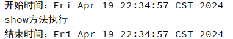

---

## 1.5 Bean的生命周期


