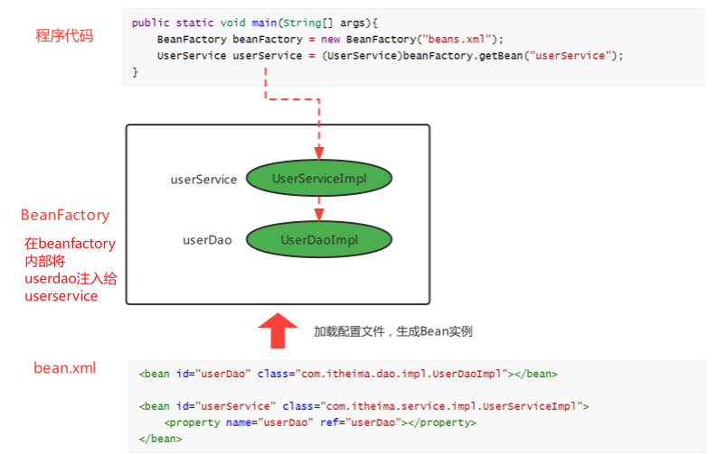
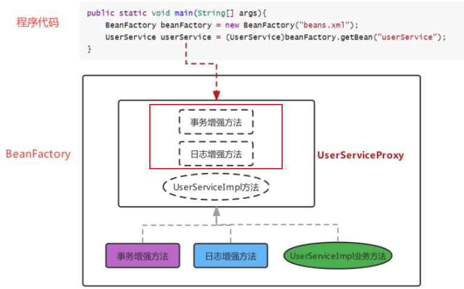
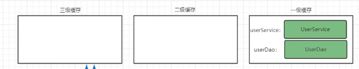

[TOC]

---

# 1 IOC容器基础

## 1.1 IOC,DI和AOP思想的提出

### 1.1.1 传统java web开发的问题


传统javaweb开发存在的问题点:

- 问题1: 层与层耦合


- 问题2: 通用功能代码和业务代码耦合


解决方式:


### 1.1.2 ioc,di和aop思想提出

#### 1.1.2.1 IoC控制反转

实际开发中，对象之间的耦合关系，就类似手表内部的齿轮，每个齿轮都紧密啮合在一起，一旦某个齿轮发生故障，那么整个系统也意味着崩溃。尽可能让对象之间的关系保持**松耦合状态**是我们期望的。

ioc(inversion of control),控制反转思想,强调的是原来在程序中**创建Bean的权利反转给第三方**

举个例子:

原本程序中的`new UserServiceImpl()`手动创建;而更具IoC的思想,需要找到一个第三方去创建,需要的时候去第三方要

- 那谁去充当第三方角色呢?

工厂设计模式,定义BeanFactory来充当,产生bean的实例

- BeanFactory怎么知道产生哪些Bean实例呢？

可以使用配置文件配置Bean的基本信息，BeanFactory根据配置文件来生产Bean实例


这样原本bean的创建权,反转给了BeanFactory


#### 1.1.2.2 DI依赖注入

上面使用BeanFactory的方式已经实现的"控制反转"，将Bean的创建权交给了BeanFactory

但是,如果我们想将UserDao的创建权也反转给BeanFactory，与此同时UserService内部还需要用到UserDao实例对象,那应该怎样操作呢？

思想:

将UserDao在BeanFactory内部设置给UserService的过程叫做“注入”，而UserService需要依赖UserDao的注入才能正常工作，这个过程叫做“依赖注入”.



#### 面试题: IoC 和 DI 的关系？

首先，先回答IoC和DI的是什么：

IoC： Inversion of Control，控制反转，将Bean的创建权由原来程序反转给第三方

DI：Dependency Injection，依赖注入，某个Bean的完整创建依赖于其他Bean（或普通参数）的注入

其次，在回答IoC和DI的关系：

第一种观点：IoC强调的是Bean创建权的反转，而DI强调的是Bean的依赖关系，认为不是一回事

第二种观点：IoC强调的是Bean创建权的反转，而DI强调的是通过注入的方式反转Bean的创建权，认为DI是IoC的其中一种实现方式

#### 1.1.2.3 AOP面向切面编程

IoC和DI思想主要是解决前面我们的问题1，问题2(通用代码与业务代码耦合)还没有解决

问题2的解决方案:

借助于IoC思想，将Bean的创建权反转给BeanFactory，而BeanFactory生产的Bean是**目标Bean的代理对象**，这样就可以在代理对象中对目标对象方法进行相应的增强。




AOP思想的提出:

- AOP，Aspect Oriented Programming，面向切面编程，是对面向对象编程OOP的升华
- OOP是纵向对同一类事物的抽象，一个对象包括静态的属性信息，包括动态的方法信息等
- 而AOP是横向的对**不同事物的抽象**，属性与属性、方法与方法、对象与对象都可以组成一个切面，而用这种思维去设计编程的方式叫做面向切面编程


#### 1.1.2.4 小节

三种思想总结

1）IoC控制反转，是将程序创建Bean的权利反转给第三方；

2）DI依赖注入，某个完整Bean需要依赖于其他Bean（或属性）的注入；

3）AOP面向切面编程，用横向抽取方法（属性、对象等）思想，组装成一个功能性切面.

### 1.1.3 框架的概念

上面提出了一些思想来解决遇到的问题，而这些思想的实现就需要通过编码去落地，往往我们把具备一定业务领域解决方案的"工具"称为框架

框架的基本特点:

- 框架（Framework），是基于基础技术之上，从众多业务中抽取出的通用解决方案；
- 框架是一个半成品，使用框架规定的语法开发可以提高开发效率，可以用简单的代码就能完成复杂的基础业务
- 框架内部使用大量的设计模式、算法、底层代码操作技术，如反射、内省、xml解析、注解解析等；

- 框架一般都具备扩展性；
- 有了框架，我们可以将精力尽可能的投入在纯业务开发上而不用去费心技术实现以及一些辅助业务.

Java中常用的框架：

不同语言，不同领域都有属于自己的框架，使用框架开发是作为程序员的最基础的底线。Java语言中的框架，可以分为基础框架和服务框架：

- 基础框架：完成基本业务操作的框架，如MyBatis、Spring、SpringMVC、Struts2、Hibernate等

- 服务框架：特定领域的框架，一般还可以对外提供服务框架，如MQ、ES、Nacos等


### 1.1.4 思想,框架和编码的关系


- 架构师（高级程序员）：把思想落地变为实现的人，例如上面的设计和BeanFactory的编写，即框架的设计和实现者。

- 程序员：使用框架完成业务的人，其中UserServiceImpl、beans.xml、测试类都是我们编写的


## 1.2 Spring框架

- spring是一个开源的轻量级Java开发应用框架，可以简化企业级应用开发

- spring解决了开发者在JavaEE开发中遇到的许多常见的问题，提供了功能强大IOC、AOP及Web MVC等功能。是当前企业中Java开发几乎不能缺少的框架之一
- spring的生态及其完善，不管是spring哪个领域的解决方案都是依附于在Spring Framework基础框架的

框架历史:

- Jsp 默默扛下所有；

- MVC+三层架构分工明确，但开发成本及其高；

- EJB 重量级框架出现，走出一个困境，有进入另一个困境；

- Spring 春天来到，随之，SSH风生水起、称霸武林；

- Spring 稳住江湖大哥位置，SSM开始上位；

- Spring 本着“拿来主义”的思维快速发展，生态不断健全；

- SpringBoot 又一里程碑崛起，把“约定大于配置“思想玩儿的炉火纯青；

- SpringCloud 打包了微服务众多解决方案，应对互联网项目更加easy！

技术栈:


### 1.2.1 BeanFactory

分析BeanFactory的开发步骤:

Ioc控制反转:

1）导入Spring的jar包或Maven坐标；

```xml
<dependency>
  <groupId>org.springframework</groupId>
  <artifactId>spring-context</artifactId>
  <version>5.3.7</version>
</dependency>
```

2）定义UserService接口及其UserServiceImpl实现类；

3）创建beans.xml配置文件，将UserServiceImpl的信息配置到该xml中；

```xml
<?xml version="1.0" encoding="UTF-8"?>
<beans xmlns="http://www.springframework.org/schema/beans"
       xmlns:xsi="http://www.w3.org/2001/XMLSchema-instance"
       xsi:schemaLocation="http://www.springframework.org/schema/beans http://www.springframework.org/schema/beans/spring-beans.xsd">

    <bean id="userService" class="com.zigzag.ch1.ioc.service.impl.UserServiceImpl"></bean>
</beans>
```

4）编写测试代码，创建BeanFactory，加载配置文件，获取UserService实例对象。

```java
// 创建BeanFactory
DefaultListableBeanFactory beanFactory = new DefaultListableBeanFactory();
// 创建xml读取器
XmlBeanDefinitionReader xmlReader = new XmlBeanDefinitionReader(beanFactory);
// 加载xml文件
xmlReader.loadBeanDefinitions("beans.xml");
// 获取bean
UserService userService = (UserServiceImpl) beanFactory.getBean("userService");

System.out.println("userService = " + userService);
```

DI依赖注入:

1）定义UserDao接口及其UserDaoImpl实现类；

2）修改UserServiceImpl代码，添加一个setUserDao(UserDao userDao)用于接收注入的对象；

```java
public void setUserDao(UserDao userDao);
```


3）修改beans.xml配置文件，在UserDaoImpl的<bean>中嵌入<property>配置注入；

```xml

<bean id="userDao" class="com.zigzag.ch1.ioc.dao.impl.UserDaoImpl"/>

<bean id="userService" class="com.zigzag.ch1.ioc.service.impl.UserServiceImpl">
<property name="userDao" ref="userDao"/>
</bean>
```


4）修改测试代码，获得UserService时，setUserService方法执行了注入操作。

```text
userDao = com.zigzag.ch1.ioc.dao.impl.UserDaoImpl@42d3bd8b
userService = com.zigzag.ch1.ioc.service.impl.UserServiceImpl@26ba2a48
```

> 注:
>
> <property name="userDao" ref="userDao" />
>
> property依赖注入调用了setUserDao方法, `set+name`

### 1.2.2 ApplicationContext

ApplicationContext称为Spring容器,内部封装了BeanFactory

比BeanFactory功能更丰富,强大

使用ApplicationContext进行开发时,xml配置文件的名称习惯写成applicationContext.xml

```xml
ApplicationContext context = new ClassPathXmlApplicationContext("beans.xml");

UserService userService = (UserService) context.getBean("userService");
System.out.println("userService = " + userService);
```

#### 1.2.2.1 BeanFactory和ApplcationContext的关系

1. BeanFactory是Spring的早期接口，称为Spring的Bean工厂，ApplicationContext是后期更高级接口，称之为Spring 容器；

2. ApplicationContext在BeanFactory基础上对功能进行了扩展，例如：监听功能、国际化功能等。BeanFactory的API更偏向底层，ApplicationContext的API大多数是对这些底层API的封装；

3. Bean创建的主要逻辑和功能都被封装在BeanFactory中，ApplicationContext不仅继承了BeanFactory，而且ApplicationContext内部还维护着BeanFactory的引用，所以，ApplicationContext与BeanFactory既有继承关系，又有融合关系。

4. **Bean的初始化时机不同**，原始BeanFactory是在首次调用getBean时才进行Bean的创建(<u>延迟加载</u>)，而ApplicationContext则是配置文件加载，容器一创建就将Bean都实例化并初始化好

ApplcationContext除了了继承了BeanFactory外，还继承了ApplicationEventPublisher（事件发布器）、ResouresPatternResolver（资源解析器）、MessageSource（消息资源）等。

但是ApplicationContext的核心功能还是BeanFactory


#### 1.2.2.2 BeanFactory和ApplicationContext的继承体系

- BeanFactory

BeanFactory是核心接口，项目运行过程中肯定有具体实现参与，这个具体实现就是DefaultListableBeanFactory，而ApplicationContext内部维护的Beanfactory的实现类也是它

ApplicationContext内部的BeanFactory实现类:


- ApplicationContext

只在Spring基础环境下，即只导入spring-context坐标时，此时ApplicationContext的继承体系:


只在Spring基础环境下，常用的三个ApplicationContext作用如下：


如果Spring基础环境中加入了其他组件解决方案，如web层解决方案，即导入spring-web坐标，此时ApplicationContext的继承体系:


在Spring的web环境下，常用的两个ApplicationContext作用如下：


---

## 1.3 基于xml的spring应用

### 1.3.1 Spring Bean的配置详解

spring开发中主要是对bean的配置,常用配置有:


#### 1.3.1.1 Bean的基本配置

```xml
<bean id="userDao" class="com.zigzag.ch1.ioc.dao.impl.UserDaoImpl"/>
```

此时存储到Spring容器（singleObjects单例池）中的Bean的beanName是userDao，值是UserDaoImpl对象，可以根据beanName获取Bean实例

- 在没有指定name的情况下,会将id转换成name
- 在没有配置id的情况下,spring会把当前bean实例的全限定名作为beanName

#### 1.3.1.2 Bean的别名配置

```xml
<bean id="userService" name="aaa,bbb" class="com.zigzag.ch1.ioc.service.impl.UserServiceImpl">
```

可以为当前Bean指定多个别名(逗号分隔)，根据别名也可以获得Bean对象

- 多个别名都可以获取实例对象

#### 1.3.1.3 Bean的范围配置

默认情况下，单纯的Spring环境Bean的作用范围有两个：Singleton和Prototype

- **singleton**：单例，默认值，Spring容器创建的时候，就会进行Bean的实例化，并存储到容器内部的单例池`singletonObjects`中，每次getBean时都是从单例池中获取相同的Bean实例；
- **prototype**：原型，Spring容器初始化时*不会*创建Bean实例，会保存信息至`beanDefinitionMap`中,当调用getBean时才会实例化Bean，每次getBean都会创建一个新的Bean实例

实验:

单例:

```xml
<bean id="userService" name="aaa,bbb" class="com.zigzag.ch1.ioc.service.impl.UserServiceImpl" scope="singleton"/>
```

```java
UserService userService = (UserService) context.getBean("userService");
UserService userService2 = (UserService) context.getBean("userService");
System.out.println(userService == userService2);  // true
```

原型:

```xml
<bean id="userService" name="aaa,bbb" class="com.zigzag.ch1.ioc.service.impl.UserServiceImpl" scope="prototype"/>
```

```xml
UserService userService = (UserService) context.getBean("userService");
UserService userService2 = (UserService) context.getBean("userService");
System.out.println(userService == userService2);  // false
```

#### 1.3.1.4 延迟加载

当lazy-init设置为true时为延迟加载，也就是当Spring容器创建的时候，不会立即创建Bean实例，等待用到时在创建Bean实例并存储到单例池中去，后续在使用该Bean直接从单例池获取即可，本质上该Bean还是单例的

```xml
<bean id="userDao" class="com.zigzag.ch1.ioc.dao.impl.UserDaoImpl" lazy-init="true"/>
```

#### 1.3.1.5 Bean的初始化和销毁方法配置

Bean在被实例化后，可以执行指定的初始化方法完成一些初始化的操作，

Bean在销毁之前也可以执行指定的销毁方法完成一些操作，初始化方法名称和销毁方法名称通过

```java
public class UserDaoImpl implements UserDao {

  public void init() {
    System.out.println("初始化方法");
  }

  public void destroy() {
    System.out.println("销毁方法");
  }
}
```

xml中配置:

```xml
<bean id="userDao" class="com.zigzag.ch1.ioc.dao.impl.UserDaoImpl" init-method="init" destroy-method="destroy"/>
```

拓展:

除此之外,我们还可以通过实现 `InitializingBean `接口，完成一些Bean的初始化操作:

afterPropertiesSet: 执行时机早于init-method

```java
public class UserDaoImpl implements UserDao, InitializingBean {

  public void init() {
    System.out.println("初始化方法");
  }

  public void destroy() {
    System.out.println("销毁方法");
  }

  @Override
  public void afterPropertiesSet() throws Exception {
    System.out.println("执行时机早于 init-method");
  }
}
```

#### 1.3.1.6 bean的实例化配置

Spring的实例化方式主要如下两种：

- 构造方式实例化：底层通过构造方法对Bean进行实例化
- 工厂方式实例化：底层通过调用自定义的工厂方法对Bean进行实例化

构造方式实例化Bean又分为无参构造方法实例化和有参构造方法实例化，

Spring中配置的`<bean>`几乎都是无参构造该方式,不需要额外配置,

**有参构造方法**实例化Bean实验如下:

```java
public UserDaoImpl(String name) {
  this.name = name;
}
```

有参构造在实例化Bean时，需要参数的注入，通过`<constructor-arg>`标签，嵌入在<bean>标签内部提供构造参

数:

```java
<bean id="userDao" class="com.zigzag.ch1.ioc.dao.impl.UserDaoImpl">
  <constructor-arg name="name" value="haohao" />
</bean>
```

**工厂方式**实例化Bean，又分为如下三种：

- *静态工厂*方法实例化Bean

静态工厂方法实例化Bean，其实就是定义一个工厂类，提供一个静态方法用于生产Bean实例，在将该工厂类及其静态方法配置给Spring即可

```java
public class UserDaoBeanFactory {
  // 静态工厂方法
  public static UserDao getUserDao(String name) {
    return new UserDaoImpl(name);
  }
}
```

```xml
<bean id="userDao" class="com.zigzag.ch1.ioc.UserDaoBeanFactory" factory-method="getUserDao">
    <constructor-arg name="name" value="haohao"/>
</bean>
```

> 注:
>
> <constructor-arg>标签不仅仅是为构造方法传递参数，只要是为了实例化对象而传递的参数都可以通过<constructor-arg>标签完成，例如上面通过静态工厂方法实例化Bean所传递的参数也是要通过<constructor-arg>进行传递的

- *实例工厂*方法实例化Bean

实例工厂方法，也就是非静态工厂方法产生Bean实例，与静态工厂方式比较，

该方式需要先有工厂对象，再用工厂对象去调用非静态方法，所以在进行配置时，要先配置工厂Bean，在配置目标Bean:

```java
public class UserDaoBeanFactory {
  // 实例工厂方法
  public UserDao getUserDao(String name) {
    return new UserDaoImpl(name);
  }
}
```

```xml
<bean id="userDaoBeanFactory" class="com.zigzag.ch1.ioc.UserDaoBeanFactory"/>

<bean id="userDao" factory-bean="userDaoBeanFactory" factory-method="getUserDao">
  <constructor-arg name="name" value="haohao"/>
</bean>
```

- 实现FactoryBean规范延迟实例化Bean

上面不管是静态工厂方式还是非静态工厂方式，都是自定义的工厂方法，

Spring提供了FactoryBean的接口规范，FactoryBean接口定义如下：

```java
// spring的bean工厂规范
public interface FactoryBean<T> {
  String OBJECT_TYPE_ATTRIBUTE = "factoryBeanObjectType";

  @Nullable
  T getObject() throws Exception; // 获取对象实例

  @Nullable
  Class<?> getObjectType(); // 获取对象类型方法

  default boolean isSingleton() {
    return true;
  }
}
```


实现FactoryBean定义bean工厂:

```java
public class UserDaoBeanFactory implements FactoryBean<UserDao> {
  @Override
  public UserDao getObject() throws Exception {
    return new UserDaoImpl();
  }

  @Override
  public Class<?> getObjectType() {
    return UserDao.class;
  }
}
```

交由spring管理:

```xml
<bean id="userDao" class="com.zigzag.ch1.ioc.UserDaoBeanFactory"/>
```

分析:

通过断点观察发现Spring容器创建时，FactoryBean被实例化了，并存储到了单例池singletonObjects中，但是getObject() 方法尚未被执行，UserDaoImpl也没被实例化，

当首次用到UserDaoImpl时，才调用getObject() ，

此工厂方式产生的Bean实例*不会存储到单例池*singletonObjects中，会存储到 `factoryBeanObjectCache` 缓存池中，并且后期每次使用到userDao都从该缓存池中返回的是同一个userDao实例。

#### 1.3.1.7 Bean的依赖注入配置

Bean的依赖注入有两种方式：

set方式(<property>)和构造器方式(<construct-arg>):


其中，

ref 是 reference 的缩写形式，翻译为：涉及，参考的意思，用于引用其他Bean的id; 

value 用于注入普通属性值

依赖注入的数据类型有如下三种：

- 普通数据类型，例如：String、int、boolean等，通过value属性指定。

- 引用数据类型，例如：UserDaoImpl、DataSource等，通过ref属性指定。

- 集合数据类型，例如：List、Map、Properties等如下:

注入 List<T> 集合 – 普通数据:

```java
public void setStrList(List<String> strList) {
  strList.forEach(System.out::println);
}
```

```xml
<bean id="userDao" class="com.zigzag.ch1.ioc.dao.impl.UserDaoImpl">
    <property name="strList">
        <list>
            <value>haohao</value>
            <value>miaomiao</value>
        </list>
    </property>
</bean>
```

注入 List<T> 集合 – 引用数据:


注入Set<T>集合:


注入 Map<K,V> 集合:


注入 Properties 键值对:


> 注:
>
> 拓展:自动装配方式
>
> 如果被注入的属性类型是Bean引用的话，那么可以在<bean> 标签中使用 autowire 属性去配置自动注入方式，属性值有两个：
>
> - byName：通过属性名自动装配，即去匹配 setXxx 与 id="xxx"（name="xxx"）是否一致；
> - byType：通过Bean的类型从容器中匹配，匹配出多个相同Bean类型时，报错。
>
> ```xml
> <bean id="userService" class="com.itheima.service.impl.UserServiceImpl" 
> autowire="byType">
> ```

#### 1.3.1.8 spring的其他配置标签

Spring 的 xml 标签大体上分为两类，一种是默认标签，一种是自定义标签

- 默认标签：就是不用额外导入其他命名空间约束的标签，例如 <bean> 标签
- 自定义标签：就是需要额外引入其他命名空间约束，并通过前缀引用的标签，例如 <context:property-placeholder/> 标签

Spring的默认标签用到的是Spring的默认命名空间


该命名空间约束下的默认标签如下：


- <beans>标签，除了经常用的做为根标签外，还可以嵌套在根标签内，使用profile属性切换开发环境


可以使用以下两种方式指定被激活的环境：

1. 使用命令行动态参数，虚拟机参数位置加载 -Dspring.profiles.active=test
2. 使用代码的方式设置环境变量 System.setProperty("spring.profiles.active","test")

- <import>标签

  用于导入其他配置文件，项目变大后，就会导致一个配置文件内容过多，可以将一个配置文件根据业务某块进行拆分，拆分后，最终通过<import>标签导入到一个主配置文件中，项目加载主配置文件就连同<import> 导入的文件一并加载了

```xml
<!--导入用户模块配置文件-->
<import resource="classpath:UserModuleApplicationContext.xml"/>
<!--导入商品模块配置文件-->
<import resource="classpath:ProductModuleApplicationContext.xml"/>
```


- <alias> 标签

  是为某个Bean添加别名，与在<bean> 标签上使用*name属性添加别名的方式一样*，我们为UserServiceImpl指定四个别名：aaa、bbb、xxx、yyy

```xml
<!--配置UserService-->
<bean id="userService" name="aaa,bbb" class="com.itheima.service.impl.UserServiceImpl">
<property name="userDao" ref="userDao"/>
</bean>

<!--指定别名-->
<alias name="userService" alias="xxx"/>
<alias name="userService" alias="yyy"/>
```

分析: 断点调试，在beanFactory中维护着一个名为aliasMap的Map<String,String>集合，存储别名和beanName之间的映射关系


- Spring的自定义标签需要引入外部的命名空间，并为外部的命名空间指定前缀，使用 <前缀:标签> 形式的标签，称之为自定义标签，自定义标签的解析流程也是 *Spring xml扩展点方式之一*，

  

### 1.3.2 Spring的getBean方法


```java
//根据beanName获取容器中的Bean实例，需要手动强转
UserService userService = (UserService) applicationContext.getBean("userService");

//根据Bean类型去容器中匹配对应的Bean实例，如存在多个匹配Bean则报错
UserService userService2 = applicationContext.getBean(UserService.class);

//根据beanName获取容器中的Bean实例，指定Bean的Type类型
UserService userService3 = applicationContext.getBean("userService", 
UserService.class);
```

### 1.3.3 Spring配置非自定义bean

以上在 xml 中配置的Bean都是自己定义的，例如：UserDaoImpl，UserServiceImpl。

但是，在实际开发中有些功能类并不是我们自己定义的，而是使用的*第三方jar包*中的，那么，这些Bean要想让Spring进行管理，也需要对其进行配置

配置非自定义的Bean需要考虑如下两个问题：

- 被配置的Bean的实例化方式是什么？无参构造、有参构造、静态工厂方式还是实例工厂方式；
- 被配置的Bean是否需要注入必要属性。

实践:

#### 配置 Druid 数据源交由Spring管理

1. 配置 DruidDataSource

```xml
<!-- mysql驱动 -->
<dependency>
  <groupId>mysql</groupId>
  <artifactId>mysql-connector-java</artifactId>
  <version>5.1.49</version>
</dependency>

<!-- druid数据源 -->
<dependency>
  <groupId>com.alibaba</groupId>
  <artifactId>druid</artifactId>
  <version>1.1.23</version>
</dependency>
```

```xml
<!--配置 DruidDataSource数据源-->
<bean class="com.alibaba.druid.pool.DruidDataSource">
  <!--配置必要属性-->
  <property name="driverClassName" value="com.mysql.jdbc.Driver"/>
  <property name="url" value="jdbc://localhost:3306/mybatis"/>
  <property name="username" value="root"/>
  <property name="password" value="root"/>
</bean>
```

2. 配置Connection交由Spring管理

Connection 的产生是通过DriverManager的静态方法getConnection获取的，所以我们要用静态工厂方式配置

```xml
<bean class="java.lang.Class" factory-method="forName">
  <constructor-arg name="className" value="com.mysql.jdbc.Driver"/>
</bean>
```

```xml
<bean id="connection" class="java.sql.DriverManager" factory-method="getConnection" 
scope="prototype">
  <constructor-arg name="url" value="jdbc:mysql://mybatis"/>
  <constructor-arg name="user" value="root"/>
  <constructor-arg name="password" value="root"/>
</bean>
```

3. 配置日期对象交由Spring管理

产生一个指定日期格式的对象，原始代码按如下：

```java
String currentTimeStr = "2023-08-27 07:20:00";
SimpleDateFormat simpleDateFormat = new SimpleDateFormat("yyyy-MM-dd HH:mm:ss");
Date date = simpleDateFormat.parse(currentTimeStr);
```

可以看成是实例工厂方式，使用Spring配置方式产生Date实例:

```xml
<bean id="simpleDateFormat" class="java.text.SimpleDateFormat">
  <constructor-arg name="pattern" value="yyyy-MM-dd HH:mm:ss"/>
</bean>
<bean id="date" factory-bean="simpleDateFormat" factory-method="parse">
  <constructor-arg name="source" value="2023-08-27 07:20:00"/>
</bean>
```

4. 配置Mybatis的SqlSessionFactory交由Spring管理

```xml
<!--mybatis框架-->
<dependency>
  <groupId>org.mybatis</groupId>
  <artifactId>mybatis</artifactId>
  <version>3.5.5</version>
</dependency>
<!-- mysql驱动 -->
<dependency>
  <groupId>mysql</groupId>
  <artifactId>mysql-connector-java</artifactId>
  <version>5.1.49</version>
</dependency>
```

MyBatis原始获得SqlSessionFactory的方式：

```java
//加载mybatis核心配置文件，使用Spring静态工厂方式
InputStream in = Resources.getResourceAsStream(“mybatis-conifg.xml”);
//创建SqlSessionFactoryBuilder对象，使用Spring无参构造方式
SqlSessionFactoryBuilder builder = new SqlSessionFactoryBuilder();
//调用SqlSessionFactoryBuilder的build方法，使用Spring实例工厂方式
SqlSessionFactory sqlSessionFactory = builder.build(in);
```

SqlSessionFactory交由Spring管理配置如下：

```xml
<!--静态工厂方式产生Bean实例-->
<bean id="inputStream" class="org.apache.ibatis.io.Resources" factory-method="getResourceAsStream">
  <constructor-arg name="resource" value="mybatis-config.xml"/>
</bean>

<!--无参构造方式产生Bean实例-->
<bean id="sqlSessionFactoryBuilder" class="org.apache.ibatis.session.SqlSessionFactoryBuilder"/>

<!--实例工厂方式产生Bean实例-->
<bean id="sqlSessionFactory" factory-bean="sqlSessionFactoryBuilder" factory-method="build">
  <constructor-arg name="inputStream" ref="inputStream"/>
</bean>
```

### 1.3.4 Bean实例化的基本流程

Spring容器在进行初始化时,

会将xml配置的`<bean>`的信息封装成一个`BeanDefinition`对象,所有的BeanDefinition存储到一个名为`beanDefinitionMap`的Map集合中去

Spring框架再对该Map进行遍历,使用反射创建Bean实例对象,创建好的bean对象存储在一个名为`singletonObjects`的Map集合中,当调用getBean方法时则最终从该Map集合中取出bean实例对象返回

BeanDefinition与xml中bean的对应关系:


 


`DefaultListableBeanFactory`对象内部维护着一个Map用于存储封装好的BeanDefinitionMap

```java
public class DefaultListableBeanFactory extends ... implements ... {
  // 存储<bean>标签对应的BeanDefinition对象
  // key:是Bean的beanName，value:是Bean定义对象BeanDefinition
  private final Map<String, BeanDefinition> beanDefinitionMap;
}
```

Spring框架会取出beanDefinitionMap中的每个BeanDefinition信息，反射构造方法或调用指定的工厂方法生成Bean实例对象，

*所以只要将BeanDefinition注册到beanDefinitionMa这个Map中，Spring就会进行对应的ean的实例化操作*

Bean实例及单例池singletonObjects，

beanDefinitionMap中的BeanDefinition会被转化成对应的Bean实例对象，存储到单例池singletonObjects中去，在`DefaultListableBeanFactory的上四级父类DefaultSingletonBeanRegistry`中，维护着singletonObjects，源码如下:

```java
public class DefaultSingletonBeanRegistry extends ... implements ... {
  // 存储Bean实例的单例池
  // key:是Bean的beanName，value:是Bean的实例对象
  private final Map<String, Object> singletonObjects = new ConcurrentHashMap(256);
}
```

基本流程梳理:

- 加载xml配置文件,解析获取配置中每个`<bean>`的形象,封装成BeanDefinition对象
- 将BeanDefinition存储在一个名为beanDefinitionMap的Map<String, BeanDefinition>中
- ApplicationContext底层遍历BeanDefinitionMap,创建Bean实力对象
- 创建好的Bean实例对象,被存储到一个名为singletonObjects的Map<String, Object>中
- 当执行applicationContext.getBean(beanName)时,从singletonObjects去匹配Bean实例返回

图示:


---

## 1.4 Spring的后处理器

Spring的后处理器是Spring对外开发的重要扩展点，

允许我们介入到Bean的整个实例化流程中来，以达到动态注册BeanDefinition，动态修改BeanDefinition，以及动态修改Bean的作用.

Spring主要有两种后处理器：

- BeanFactoryPostProcessor：Bean工厂后处理器，在BeanDefinitionMap填充完毕，Bean实例化之前执行；
- BeanPostProcessor：Bean后处理器，一般在Bean实例化之后，填充到单例池singletonObjects之前执行。

### 1.4.1 BeanFactoryPostProcessor

BeanFactoryPostProcessor是一个接口规范，实现了该接口的类只要交由Spring容器管理的话，那么Spring就会回调该接口的方法，用于对BeanDefinition注册和修改的功能

```java
public class MyBeanFactoryPostProcessor implements BeanFactoryPostProcessor {
  @Override
  public void postProcessBeanFactory(ConfigurableListableBeanFactory configurableListableBeanFactory) throws BeansException {
    System.out.println("MyBeanFactoryPostProcessor执行了");
  }
}
```

```xml
<bean class="com.zigzag.ch1.ioc.processor.MyBeanFactoryPostProcessor"/>
```

postProcessBeanFactory 参数本质就是 *DefaultListableBeanFactory*,拿到BeanFactory的引用，自然就可以对beanDefinitionMap中的BeanDefinition进行操作了,

例如对UserDaoImpl的BeanDefinition进行修改操作:

```java
public class MyBeanFactoryPostProcessor implements BeanFactoryPostProcessor {
  public void postProcessBeanFactory(ConfigurableListableBeanFactory beanFactory) 
    throws BeansException {
    BeanDefinition userDaoBD = beanFactory.getBeanDefinition(“userDao”);//获得UserDao定义对象
    userDaoBD.setBeanClassName("com.itheima.dao.impl.UserDaoImpl2"); //修改class
    //userDaoBD.setInitMethodName(methodName); //修改初始化方法
    //userDaoBD.setLazyInit(true); //修改是否懒加载
    //... 省略其他的设置方式 ...
  }
}
```

例如还可以对注册一个BeanDefinition:

```java
public class MyBeanFactoryPostProcessor implements BeanFactoryPostProcessor {
  @Override
  public void postProcessBeanFactory(ConfigurableListableBeanFactory beanFactory) throws BeansException {

    // 将ConfigurableListableBeanFactory强转成子类DefaultListableBeanFactory
    // DefaultListableBeanFactory具有往BeanDefinitionMap中存入数据的方法
    if (beanFactory instanceof DefaultListableBeanFactory) {
      DefaultListableBeanFactory defaultListableBeanFactory = (DefaultListableBeanFactory)
        beanFactory;
      // 动态注册PersonDaoImpl,存入BeanDefinitionMap
      RootBeanDefinition beanDefinition = new RootBeanDefinition();
      beanDefinition.setBeanClassName("com.zigzag.ch1.ioc.dao.impl.PersonDaoImpl");
      defaultListableBeanFactory.registerBeanDefinition("personDao", beanDefinition);
    }
  }
}
```

实际上,Spring提供了一个BeanFactoryPostProcessor的子接口`BeanDefinitionRegistryPostProcessor`

专门用于注册BeanDefinition的操作:

```java
/**
 * BeanDefinitionRegistryPostProcessor,
 * BeanFactoryPostProcessor子接口,专门用于注册BeanDefinition
 *
 * @author qlk
 */
public class MyBeanFactoryPostProcessor2 implements BeanDefinitionRegistryPostProcessor {
  @Override
  public void postProcessBeanDefinitionRegistry(BeanDefinitionRegistry registry) throws BeansException {
    RootBeanDefinition beanDefinition = new RootBeanDefinition();
    beanDefinition.setBeanClassName("com.zigzag.ch1.ioc.dao.impl.PersonDaoImpl2");
    registry.registerBeanDefinition("personDao2", beanDefinition);
  }

  @Override
  public void postProcessBeanFactory(ConfigurableListableBeanFactory beanFactory) throws BeansException {

  }
}
```

```xml
<bean class="com.zigzag.ch1.ioc.processor.MyBeanFactoryPostProcessor2"/>
```

综上,比较完整的bean注册流程如下:


BeanFactoryPostProcessor 在SpringBean的实例化过程中的体现在beanDefinitionMap到singletonObjects

### 案例:使用bean工厂后处理器+注解,完成自定义注解扫描

要求如下：

- 自定义@MyComponent注解，使用在类上；

- 使用资料中提供好的包扫描器工具BaseClassScanUtils 完成指定包的类扫描；

- 自定义BeanFactoryPostProcessor完成注解@MyComponent的解析，解析后最终被Spring管理。

编码:

1. 扫描包下所有类的注解信息

```java
public class BaseClassScanUtils {

    //设置资源规则
    private static final String RESOURCE_PATTERN = "/**/*.class";

    public static Map<String, Class> scanMyComponentAnnotation(String basePackage) {

        //创建容器存储使用了指定注解的Bean字节码对象
        Map<String, Class> annotationClassMap = new HashMap<String, Class>();

        //spring工具类，可以获取指定路径下的全部类
        ResourcePatternResolver resourcePatternResolver = new PathMatchingResourcePatternResolver();
        try {
            String pattern = ResourcePatternResolver.CLASSPATH_ALL_URL_PREFIX +
                    ClassUtils.convertClassNameToResourcePath(basePackage) + RESOURCE_PATTERN;
            Resource[] resources = resourcePatternResolver.getResources(pattern);
            //MetadataReader 的工厂类
            MetadataReaderFactory refractory = new CachingMetadataReaderFactory(resourcePatternResolver);
            for (Resource resource : resources) {
                //用于读取类信息
                MetadataReader reader = refractory.getMetadataReader(resource);
                //扫描到的class
                String classname = reader.getClassMetadata().getClassName();
                Class<?> clazz = Class.forName(classname);
                //判断是否属于指定的注解类型
                if(clazz.isAnnotationPresent(MyComponent.class)){
                    //获得注解对象
                    MyComponent annotation = clazz.getAnnotation(MyComponent.class);
                    //获得属value属性值
                    String beanName = annotation.value();
                    //判断是否为""
                    if(beanName!=null&&!beanName.equals("")){
                        //存储到Map中去
                        annotationClassMap.put(beanName,clazz);
                        continue;
                    }

                    //如果没有为"",那就把当前类的类名作为beanName
                    annotationClassMap.put(clazz.getSimpleName(),clazz);

                }
            }
        } catch (Exception exception) {
        }

        return annotationClassMap;
    }

    public static void main(String[] args) {
        Map<String, Class> stringClassMap = scanMyComponentAnnotation("com.zigzag.ch1.ioc");
        System.out.println(stringClassMap);
    }
}
```


2 自定义@MyComponnet注解

```java
@Target(ElementType.TYPE)
@Retention(RetentionPolicy.RUNTIME)
public @interface MyComponent {

    // 指定beanName
    String value() default "";
}
```

3 自定义BeanFactoryPostprocessor注册BeanDefinition

```java
public class MyComponentBeanFactoryPostProcessor implements BeanDefinitionRegistryPostProcessor {
    @Override
    public void postProcessBeanDefinitionRegistry(BeanDefinitionRegistry registry) throws BeansException {
        // 指定要扫描的包
        String packageName = "com.zigzag.ch1.ioc";
        // 调用工具类,扫描@MyComponent注解的类进行注册
        Map<String, Class> myComponentClassMap = BaseClassScanUtils.scanMyComponentAnnotation(packageName);
        // 遍历这个map,创建BeanDefinition对象进行注册
        myComponentClassMap.forEach((beanName, clazz) -> {
            RootBeanDefinition beanDefinition = new RootBeanDefinition();
            beanDefinition.setBeanClassName(clazz.getName());
            try {
                registry.registerBeanDefinition(beanName, beanDefinition);
            } catch (BeanDefinitionStoreException e) {
                e.printStackTrace();
            }
        });
    }

    @Override
    public void postProcessBeanFactory(ConfigurableListableBeanFactory beanFactory) throws BeansException {

    }
}
```

4. 注册bean

```xml
<bean class="com.zigzag.ch1.ioc.processor.MyComponentBeanFactoryPostProcessor"/>
```

结果: 

```java
TestBean testBean = (TestBean) context.getBean("TestBean");
System.out.println("testBean = " + testBean);
```


---

### 1.4.3 BeanPostProcessor

Bean被实例化后，到最终缓存到名为singletonObjects单例池之前，中间会经过Bean的初始化过程

例如:

- 属性的填充
- 初始化方法等

其中有一个对外进行扩展的点BeanPostProcessor，我们称为Bean后处理器

跟上面的Bean工厂后处理器相似，它也是一个接口，实现了该接口并被容器管理的BeanPostProcessor，会在流程节点上被Spring自动调用

`BeanPostProcessor`的接口定义如下:

```java
public interface BeanPostProcessor {
  // 在属性注入完毕,init初始化方法执行之前被回调
  @Nullable
  default Object postProcessBeforeInitialization(Object bean, String beanName) throws BeansException {
    return bean;
  }
  
  // 在初始化方法执行之后,被添加到单例池singletonObjects之前被回调
  @Nullable
  default Object postProcessAfterInitialization(Object bean, String beanName) throws BeansException {
    return bean;
  }
}
```

自定义MyBeanPostProcessor，

```java
public class MyBeanPostProcessor implements BeanPostProcessor {

  /**
     * 参数： bean是当前被实例化的Bean，beanName是当前Bean实例在容器中的名称
     * 返回值：当前Bean实例对象
     * 属性注入完成,初始化方法之前
     */
  @Override
  public Object postProcessBeforeInitialization(Object bean, String beanName) throws BeansException {
    // 此处可以给bean注入属性值
    if (bean instanceof UserDaoImpl) {
      UserDaoImpl userDao = (UserDaoImpl) bean;
      userDao.setName("好好");
    }
    System.out.println(beanName + ":postProcessBeforeInitialization");
    return bean;
  }

  /**
     * 参数： bean是当前被实例化的Bean，beanName是当前Bean实例在容器中的名称
     * 返回值：当前Bean实例对象
     * 在初始化方法执行之后
     */
  @Override
  public Object postProcessAfterInitialization(Object bean, String beanName) throws BeansException {
    System.out.println(beanName + ":postProcessAfterInitialization");
    return bean;
  }
}
```

BeanPostProcessor方法执行位置:

```java
public class UserDaoImpl implements UserDao, InitializingBean {

  private String name;

  public UserDaoImpl() {
    System.out.println("UserDaoImpl无参初始化方法");
  }

  public UserDaoImpl(String name) {
    System.out.println("UserDaoImpl有参初始化方法");
    this.name = name;
  }

  public void setName(String name) {
    this.name = name;
  }

  public void init() {
    System.out.println("init初始化方法");
  }

  public void destroy() {
    System.out.println("销毁方法");
  }

  @Override
  public void afterPropertiesSet() throws Exception {
    System.out.println("执行时机早于 init-method,afterPropertiesSet:属性注入后执行");
  }

  // 对应set方法,为strList注入值
  public void setStrList(List<String> strList) {
    strList.forEach(System.out::println);
  }
}
```

```xml
<bean id="userDao" class="com.zigzag.ch1.ioc.dao.impl.UserDaoImpl" init-method="init">
  <property name="name" value="坏坏" />
</bean>
```

结果:


- 先构造器方法
- 执行postProcessBeforeInitialization (由BeanPostProcessor提供)
- 实现InitializingBean后的afterPropertiesSet()方法 (由InitializingBean提供)
- 指定的初始化方法
- 最后执行postProcessAfterInitialization (由BeanPostProcessor提供)

在`BeanPostProcessor`的两个方法中,可以执行afterPropertiesSet和初始化方法

---

综上,加入bean后处理器的bean注册图示:


BeanPostProcessor 在 SpringBean

的实例化过程中的体现

### 案例,使用bean后处理器实现执行时间日志增强

要求如下：

- Bean的方法执行之前控制台打印当前时间；

- Bean的方法执行之后控制台打印当前时间

分析:

- 对方法进行增强主要就是代理设计模式和包装设计模式；

- 由于Bean方法不确定，所以使用动态代理在运行期间执行增强操作；

- 在Bean实例创建完毕后，进入到单例池之前，使用Proxy代替真是的目标Bean

编码:

1. bean进入sigletonObjects前,使用代码对bean的方法进行增强,并将增强的代理对象替换到单例池中

```java
public class TimeLogBeanPostProcessor implements BeanPostProcessor {
  @Override
  public Object postProcessAfterInitialization(Object bean, String beanName) throws BeansException {
    System.out.println("TimeLogBeanPostProcessor:postProcessAfterInitialization");

    //对Bean进行动态代理，返回的是Proxy代理对象
    Object proxyBean = Proxy.newProxyInstance(
      bean.getClass().getClassLoader(),
      bean.getClass().getInterfaces(),
      (Object proxy, Method method, Object[] args) -> {
        long start = System.currentTimeMillis();
        System.out.println("开始时间：" + new Date(start));
        //执行目标方法
        Object result = method.invoke(bean, args);
        long end = System.currentTimeMillis();
        System.out.println("结束时间：" + new Date(end));
        return result;
      });

    //返回代理对象,注入到单例对象池
    return proxyBean;
  }
}
```

进入sigletonObjects的对象是增强后的代理对象:


2. 调用

```java
UserDao userDao = (UserDao) context.getBean("userDao");
userDao.showTimeLog();
```

结果:


---

## 1.5 Bean的生命周期

Spring Bean的生命周期是从 Bean 实例化之后，即通过反射创建出对象之后，到Bean成为一个完整对象，最终存储到单例池中，这个过程被称为Spring Bean的生命周期

Spring Bean的生命周期大体上分为三个阶段:

- Bean的实例化阶段

Spring框架会取出BeanDefinition的信息进行判断当前Bean的范围是否是singleton的，是否不是延迟加载的，是否不是FactoryBean等，最终将一个普通的singleton的Bean通过反射进行实例化

- Bean的初始化阶段

Bean创建之后还仅仅是个"半成品"，还需要对Bean实例的属性进行填充、执行一些Aware接口方法、执行BeanPostProcessor方法、执行InitializingBean接口的初始化方法、执行自定义初始化init方法等。

*该阶段是Spring最具技术含量和复杂度的阶段*，Aop增强功能，后面要学习的Spring的注解功能等、spring高频面试题Bean的循环引用问题都是在这个阶段体现的；

- Bean的完成阶段

经过初始化阶段，Bean就成为了一个完整的Spring Bean，被存储到单例池singletonObjects中去了，即完成了Spring Bean的整个生命周期

### 1.5.1 bean的初始化阶段

着重研究Bean的初始化阶段,Bean的初始化过程涉及如下几个过程：

- Bean实例的属性填充
- Aware接口属性注入
- BeanPostProcessor的before()方法回调
- InitializingBean接口的初始化方法回调
- 自定义初始化方法init回调
- BeanPostProcessor的after()方法回调

### 1.5.2 Bean实例属性填充

```xml
<bean id="userService" class="com.zigzag.ch1.ioc.service.impl.UserServiceImpl">
  <property name="userDao" ref="userDao" />
</bean>
```

当xml中配置`property`时,在`BeanDefinitionMap`中维护了userService,同时还在`propertyValue`中维护了注入属性


Spring在进行属性注入时，会分为如下几种情况:

- 注入普通属性，String、int或存储基本类型的集合时，直接通过set方法的反射设置进去；

- 注入单向对象引用属性时，从容器中getBean获取后通过set方法反射设置进去，如果容器中没有，则先创建被注入对象Bean实例（完成整个生命周期）后，再进行注入操作；

- 注入*双向对象引用属性*时，就比较复杂了，涉及了循环引用（循环依赖）问题，下面会详细阐述解决方案


#### 1.5.2.1 循环引用

 多个实体之间相互依赖并形成闭环的情况就叫做"循环依赖"，也叫做"循环引用":


使用图示描述这个循环引用的过程:


分析:

- 在实例化service的过程中,只想到属性填充userDao时,需要判断单例池中是否存在,结果没有,则转到实例化Dao的过程
- 而在实例化dao的过程中,同样需要填充userService,但此时在单例池中不存在完整的service对象,导致两个创建过程相互等待

解决方案:

spring的三级缓存

#### 1.5.2.2 三级缓存

Spring提供了**三级缓存**存储 完整Bean实例 和 半成品Bean实例 ，用于解决循环引用问题

在`DefaultListableBeanFactory`的上四级父类`DefaultSingletonBeanRegistry`中提供如下三个Map：


```java
// 1. 最终存储单例Bean成品的容器,即实例化和初始化都完成的bean,称之为一级缓存
private final Map<String, Object> singletonObjects = new ConcurrentHashMap<>(256);

// 2. 早期Bean单例池,缓存半成品对象,且当前对象已经被其他对象引用了,称之为二级缓存
private final Map<String, Object> earlySingletonObjects = new ConcurrentHashMap<>(16);

// 3. 单例Bean的工厂池,缓存半成品对象,对象未被引用,使用时在通过工厂创建Bean,称之为三级缓存
private final Map<String, ObjectFactory<?>> singletonFactories = new HashMap<>(16);
```

结合上述循环引用图示说明三级缓存的作用:

- userservice实例化对象,但尚未初始化,将userservice存储到三级缓存中
- userservice属性注入,需要userdao,尝试从一级缓存中获取,但是没有
- 转到userdao实例化对象,但尚未初始化,将userdao存储到三级缓存中
- userdao属性注入,需要userservice,在三级缓存中获取到了userservice,此时,userservice将从三级缓存中移入二级缓存
- userdao执行其他生命周期过程,最终成为一个完整bean,此时,将userdao存储到一级缓存中,同时删除二,三级缓存
- userservice此时可以注入userdao了
- userservice执行其他生命周期过程,最终成为一个完整bean,同时存入一级缓存,删除二,三级缓存

过程图示:

首先实例创建创建存储到三级缓存中


当三级缓存中存在service了


userdao再执行其他生命周期方法,完成成品创建,存入到一级缓存

同时,userservice由于被userdao引用,移入二级缓存


最终,当userservice完成创建时,




### 1.5.3 Aware接口

在属性注入阶段的源码中,接触到了Aware接口

Aware接口是一种框架辅助属性注入的一种思想，其他框架中也可以看到类似的接口。框架具备高度封装性，我们接触到的一般都是业务代码，一个底层功能API不能轻易的获取到

但是这不意味着永远用不到这些对象，如果用到了，就可以使用框架提供的类似Aware的接口，让框架给我们注入该对象

常用的Aware接口:


### 1.5.4 完整的IoC整体流程


## 1.6 spring xml方式整合第三方框架(待完善)

xml整合第三方框架有两种整合方案：

- 不需要自定义名空间，不需要使用Spring的配置文件配置第三方框架本身内容，例如：MyBatis；
- 需要引入第三方框架命名空间，需要使用Spring的配置文件配置第三方框架本身内容，例如：Dubbo

> 注
>
> `https://www.bilibili.com/video/BV1rt4y1u7q5?p=57&spm_id_from=pageDriver&vd_source=ab5e1f9a0ba81f9c34127c507996b43b`
>
> 此处整合过多依赖源码

### 1.6.1 整合MyBatis(不需要自定义命名空间)

Spring整合MyBatis，之前已经在Spring中简单的配置了SqlSessionFactory，但是这不是正规的整合方式，MyBatis提供了`mybatis-spring.jar`专门用于两大框架的整合

Spring整合MyBatis的步骤如下：

- 导入MyBatis整合Spring的相关坐标;
- 编写Mapper和Mapper.xml；
- 配置SqlSessionFactoryBean和MapperScannerConfigurer；
- 编写测试代码


1. 配置SqlSessionFactoryBean和MapperScannerConfigurer：

`applicationContext.xml`文件

```xml
<!--配置数据源-->
<bean id="dataSource" class="com.alibaba.druid.pool.DruidDataSource">
  <property name="url" value="jdbc:mysql://localhost:3306/mybatis"></property>
  <property name="username" value="root"></property>
  <property name="password" value="root"></property>
</bean>
<!--配置SqlSessionFactoryBean-->
<bean class="org.mybatis.spring.SqlSessionFactoryBean">
  <property name="dataSource" ref="dataSource"></property>
</bean>
<!--配置Mapper包扫描-->
<bean class="org.mybatis.spring.mapper.MapperScannerConfigurer">
  <property name="basePackage" value="com.itheima.dao"></property>
</bean>
```

2. 编写Mapper和Mapper.xml

```java
public interface UserMapper {
  List<User> findAll();
}
```

```xml
<?xml version="1.0" encoding="UTF-8" ?>
<!DOCTYPE mapper
PUBLIC "-//mybatis.org//DTD Mapper 3.0//EN"
"http://mybatis.org/dtd/mybatis-3-mapper.dtd">
<mapper namespace="com.itheima.dao.UserMapper">
  <select id="findAll" resultType="com.itheima.pojo.User">
    select * from tb_user
  </select>
</mapper>
```

3. 编写测试代码

```java
ClassPathxmlApplicationContext applicationContext =
  new ClassPathxmlApplicationContext("applicationContext.xml");
UserMapper userMapper = applicationContext.getBean(UserMapper.class);
List<User> all = userMapper.findAll();
System.out.println(all);
```

分析:

Spring整合MyBatis的原理剖析

整合包里提供了一个SqlSessionFactoryBean和一个扫描Mapper的配置对象，

SqlSessionFactoryBean一旦被实例化，就开始扫描Mapper并通过动态代理产生Mapper的实现类存储到Spring容器中

相关的有如下四个类：

- SqlSessionFactoryBean：需要进行配置，用于提供SqlSessionFactory；
- MapperScannerConfigurer：需要进行配置，用于扫描指定mapper注册BeanDefinition；
- MapperFactoryBean：Mapper的FactoryBean，获得指定Mapper时调用getObject方法；
- ClassPathMapperScanner：definition.setAutowireMode(2) 修改了自动注入状态，所以MapperFactoryBean中的setSqlSessionFactory会自动注入进去


配置`SqlSessionFactoryBean`作用是向容器中提供SqlSessionFactory，SqlSessionFactoryBean实现了FactoryBean和InitializingBean两个接口，所以会自动执行getObject() 和afterPropertiesSet()方法

```java
SqlSessionFactoryBean implements FactoryBean<SqlSessionFactory>, InitializingBean{
  public void afterPropertiesSet() throws Exception {
    //创建SqlSessionFactory对象
    this.sqlSessionFactory = this.buildSqlSessionFactory();
  }
  public SqlSessionFactory getObject() throws Exception {
    return this.sqlSessionFactory;
  }
}
```

配置`MapperScannerConfigurer`作用是扫描Mapper，向容器中注册Mapper对应的MapperFactoryBean，MapperScannerConfigurer实现了BeanDefinitionRegistryPostProcessor和InitializingBean两个接口，会在postProcessBeanDefinitionRegistry方法中向容器中注册MapperFactoryBean

```java
class MapperScannerConfigurer implements BeanDefinitionRegistryPostProcessor, InitializingBean{
  public void postProcessBeanDefinitionRegistry(BeanDefinitionRegistry registry) {
    ClassPathMapperScanner scanner = new ClassPathMapperScanner(registry);
    scanner.scan(StringUtils.tokenizeToStringArray(this.basePackage, ",; \t\n"));
  }
}
```

配置`ClassPathMapperScanner`完成自动注入

```java
class ClassPathMapperScanner extends ClassPathBeanDefinitionScanner {
  public Set<BeanDefinitionHolder> doScan(String... basePackages) {
    Set<BeanDefinitionHolder> beanDefinitions = super.doScan(basePackages);
    if (beanDefinitions.isEmpty()) {
    } else {
      this.processBeanDefinitions(beanDefinitions);
    }
  }
  private void processBeanDefinitions(Set<BeanDefinitionHolder> beanDefinitions) {
    //设置Mapper的beanClass是org.mybatis.spring.mapper.MapperFactoryBean
    definition.setBeanClass(this.mapperFactoryBeanClass);
    definition.setAutowireMode(2); //设置MapperBeanFactory 进行自动注入
  }
}
```

```java
class ClassPathBeanDefinitionScanner{
  public int scan(String... basePackages) {
    this.doScan(basePackages);
  }
  protected Set<BeanDefinitionHolder> doScan(String... basePackages) {
    //将扫描到的类注册到beanDefinitionMap中，此时beanClass是当前类全限定名
    this.registerBeanDefinition(definitionHolder, this.registry);
    return beanDefinitions;
  }
}
```

调用

```java
UserMapper userMapper = applicationContext.getBean(UserMapper.class);
```

```java
public class MapperFactoryBean<T> extends SqlSessionDaoSupport implements FactoryBean<T> {
  public MapperFactoryBean(Class<T> mapperInterface) {
    this.mapperInterface = mapperInterface;
  }
  public void setSqlSessionFactory(SqlSessionFactory sqlSessionFactory) {
    this.sqlSessionTemplate = this.createSqlSessionTemplate(sqlSessionFactory);
  }
  public T getObject() throws Exception {
    return this.getSqlSession().getMapper(this.mapperInterface);
  }
}
```


### 1.6.2 整合自定义标签(例如dubbo)

Spring 整合其他组件时就不像MyBatis这么简单了，例如Dubbo框架在于Spring进行整合时，要使用Dubbo提供的命名空间的扩展方式，自定义了一些Dubbo的标签

```xml
<?xml version="1.0" encoding="UTF-8"?>
<beans xmlns="http://www.springframework.org/schema/beans"
       xmlns:xsi="http://www.w3.org/2001/XMLSchema-instance" 
       xmlns:dubbo="http://dubbo.apache.org/schema/dubbo"
       xsi:schemaLocation="http://www.springframework.org/schema/beans 
                           http://www.springframework.org/schema/beans/spring-beans.xsd 
                           http://dubbo.apache.org/schema/dubbo http://dubbo.apache.org/schema/dubbo/dubbo.xsd">
  <!--配置应用名称-->
  <dubbo:application name="dubbo1-consumer"/>
  <!--配置注册中心地址-->
  <dubbo:registry address="zookeeper://localhost:2181"/>
  <!--扫描dubbo的注解-->
  <dubbo:annotation package="com.itheima.controller"/>
  <!--消费者配置-->
  <dubbo:consumer check="false" timeout="1000" retries="0"/>
</beans>
```

以Spring的 context 命名空间去进行分析，该方式也是**命名空间扩展方式**

需求：加载外部properties文件，将键值对存储在Spring容器中

```
jdbc.url=jdbc:mysql://localhost:3306/mybatis
jdbc.username=root
jdbc.password=root
```

引入context命名空间，在使用context命名空间的标签，使用SpEL表达式在xml或注解中根据key获得value

```xml
<beans xmlns="http://www.springframework.org/schema/beans"
       xmlns:context="http://www.springframework.org/schema/context"
       xmlns:xsi="http://www.w3.org/2001/XMLSchema-instance"
       xsi:schemaLocation="http://www.springframework.org/schema/beans 
                           http://www.springframework.org/schema/beans/spring-beans.xsd
                           http://www.springframework.org/schema/context 
                           http://www.springframework.org/schema/context/spring-context.xsd">
  <context:property-placeholder location="classpath:jdbc.properties" />
  <bean id="dataSource" class="com.alibaba.druid.pool.DruidDataSource">
    <property name="url" value="${jdbc.url}"></property>
    <property name="username" value="${jdbc.username}"></property>
    <property name="password" value="${jdbc.password}"></property>
  </bean>
  <beans>
```

其实，加载的properties文件中的属性最终通过Spring解析后会被存储到了Spring容器的environment中去，不仅自己定义的属性会进行存储，Spring也会把环境相关的一些属性进行存储


分析源码:

原理剖析解析过程，只能从源头ClassPathXmlApplicationContext入手

1）在创建DefaultNamespaceHandlerResolver时，为处理器映射地址handlerMappingsLocation属性赋值，并加载命名空间处理器到Map<String, Object> handlerMappings 中去

```xml
this.handlerMappingsLocation = "META-INF/spring.handlers";
```


第一点完成后，Map集合handlerMappings就被填充了很多XxxNamespaceHandler，

2）在DefaultBeanDefinitionDocumentReader的parseBeanDefinitions方法中,有以下逻辑:

```java
//如果是默认命名空间
if (delegate.isDefaultNamespace(ele)) {
  this.parseDefaultElement(ele, delegate);
  //否则是自定义命名空间
} else {
  delegate.parseCustomElement(ele);
}
```

如果是默认命名空间，则执行parseDefaultElement方法

```java
private void parseDefaultElement(Element ele, BeanDefinitionParserDelegate delegate) {
  if (delegate.nodeNameEquals(ele, "import")) {
    this.importBeanDefinitionResource(ele);
  } else if (delegate.nodeNameEquals(ele, "alias")) {
    this.processAliasRegistration(ele);
  } else if (delegate.nodeNameEquals(ele, "bean")) {
    this.processBeanDefinition(ele, delegate);
  } else if (delegate.nodeNameEquals(ele, "beans")) {
    this.doRegisterBeanDefinitions(ele);
  }
}
```

如果是自定义命名空间，则执行parseCustomElement方法

```java
public BeanDefinition parseCustomElement(Element ele, @Nullable BeanDefinition containingBd) {
  //解析命名空间
  String namespaceUri = this.getNamespaceURI(ele);
  //获得命名空间解析器
  NamespaceHandler handler = this.readerContext.getNamespaceHandlerResolver().resolve(namespaceUri);
  //解析执行的标签
  return handler.parse(ele, new ParserContext(this.readerContext, this, containingBd));
}
```

在执行resovle方法时，就是从Map<String, Object> handlerMappings中根据命名空间名称获得对应的处理器对象，此处是ContextNamespaceHandler，最终执行NamespaceHandler的parse方法

ContextNamespaceHandler源码如下，间接实现了NamespaceHandler接口，初始化方法init会被自动调用。由于context命名空间下有多个标签，所以每个标签又单独注册了对应的解析器，注册到了其父类NamespaceHandlerSupport的Map<String, BeanDefinitionParser> parsers中去了

```java
public class ContextNamespaceHandler extends NamespaceHandlerSupport {
  public ContextNamespaceHandler() {
  }
  public void init() {
    this.registerBeanDefinitionParser("property-placeholder", new 
                                      PropertyPlaceholderBeanDefinitionParser());
    this.registerBeanDefinitionParser("property-override", new PropertyOverrideBeanDefinitionParser());
    this.registerBeanDefinitionParser("annotation-config", new AnnotationConfigBeanDefinitionParser());
    this.registerBeanDefinitionParser("component-scan", new ComponentScanBeanDefinitionParser());
    this.registerBeanDefinitionParser("load-time-weaver", new LoadTimeWeaverBeanDefinitionParser());
    this.registerBeanDefinitionParser("spring-configured", new SpringConfiguredBeanDefinitionParser());
    this.registerBeanDefinitionParser("mbean-export", new MBeanExportBeanDefinitionParser());
    this.registerBeanDefinitionParser("mbean-server", new MBeanServerBeanDefinitionParser());
  }
}
```

通过上述分析，我们清楚的了解了外部命名空间标签的执行流程，如下：

- 将自定义标签的约束 与 物理约束文件与网络约束名称的约束 以键值对形式存储到一个spring.schemas文件里，该文件存储在类加载路径的 META-INF里，Spring会自动加载到;
- 将自定义命名空间的名称 与 自定义命名空间的处理器映射关系 以键值对形式存在到一个叫spring.handlers文件里，该文件存储在类加载路径的 META-INF里，Spring会自动加载到
- 准备好NamespaceHandler，如果命名空间只有一个标签，那么直接在parse方法中进行解析即可，一般解析结果就是注册该标签对应的BeanDefinition。如果命名空间里有多个标签，那么可以在init方法中为每个标签都注册一个BeanDefinitionParser，在执行NamespaceHandler的parse方法时在分流给不同BeanDefinitionParser进行解析(重写doParse方法即可)


### 1.6.3 案例: 自定义命名空间整合

设想自己是一名架构师，进行某一个框架与Spring的集成开发，效果是通过一个指示标签，向Spring容器中自动注入一个BeanPostProcessor


步骤分析:

1. 确定命名空间名称、schema虚拟路径、标签名称；

2. 编写schema约束文件haohao-annotation.xsd
3. 在类加载路径下创建META目录，编写约束映射文件spring.schemas和处理器映射文件spring.handlers
4. 编写命名空间处理器 HaohaoNamespaceHandler，在init方法中注册HaohaoBeanDefinitionParser
5. 编写标签的解析器 HaohaoBeanDefinitionParser，在parse方法中注册HaohaoBeanPostProcessor
6. 编写HaohaoBeanPostProcessor


调用:

1. 在applicationContext.xml配置文件中引入命名空间
2. 在applicationContext.xml配置文件中使用自定义的标签


**编码:**


```xml
// haohao-annotation.xsd
<?xml version="1.0" encoding="UTF-8"?>

<xsd:schema xmlns="http://www.zigzag.com/haohao"
            xmlns:xsd="http://www.w3.org/2001/XMLSchema"
            targetNamespace="http://www.zigzag.com/haohao">

  <xsd:element name="annotation-driven" />

</xsd:schema>
```

```xml
// spring.handlers
http\://www.zigzag.com/haohao=com.zigzag.ch1.handlers.HaohaoNamespaceHandler
```

```xml
// spring.schemas
http\://www.zigzag.com/haohao/haohao-annotation.xsd=com/zigzag/haohao/config/haohao-annotation.xsd
```

```xml
// beans.xml
<beans xmlns="http://www.springframework.org/schema/beans"
       xmlns:xsi="http://www.w3.org/2001/XMLSchema-instance"
       xmlns:haohao="http://www.zigzag.com/haohao"
       xsi:schemaLocation="
       http://www.springframework.org/schema/beans
       http://www.springframework.org/schema/beans/spring-beans.xsd
       http://www.zigzag.com/haohao
       http://www.zigzag.com/haohao/haohao-annotation.xsd">
  
  <!--自定义命名空间的标签-->
    <haohao:annotation-driven></haohao:annotation-driven>
```

---


```java
public class HaohaoNamespaceHandler extends NamespaceHandlerSupport {

    // 初始化,一般情况下,一个命名空间下有多个标签
    // 会在init方法中为每一个标签注册一个标签解析器
    @Override
    public void init() {
        this.registerBeanDefinitionParser("annotation-driven",new HaohaoBeanDefinitionParser());
    }
}
```

```java
public class HaohaoBeanDefinitionParser implements BeanDefinitionParser {
    @Override
    public BeanDefinition parse(Element element, ParserContext parserContext) {
        //创建HaohaoBeanPostProcessor的BeanDefinition
        RootBeanDefinition beanDefinition = new RootBeanDefinition();
        beanDefinition.setBeanClass(HaohaoBeanPostProcessor.class);
        //注册HaohaoBeanPostProcessor
        parserContext.getRegistry().registerBeanDefinition("haohaoBeanPostProcessor", beanDefinition);
        return beanDefinition;
    }
}
```

```java
public class HaohaoBeanPostProcessor implements BeanPostProcessor {
  @Override
  public Object postProcessBeforeInitialization(Object bean, String beanName) throws
    BeansException {
    System.out.println("自动注入HaohaoBeanPostProcessor成功");
    return bean;
  }
}
```

---

## 1.7 基于注解的Spring应用 

### 1.7.1 bean基本注解

Spring除了xml配置文件进行配置之外，还可以使用注解方式进行配置，注解方式慢慢成为xml配置的替代方案

Spring提供的注解有三个版本：

- 2.0时代，Spring开始出现注解
- 2.5时代，Spring的Bean配置可以使用注解完成
- 3.0时代，Spring其他配置也可以使用注解完成，我们进入全注解时代

基本Bean注解，主要是使用注解的方式替代原有xml的 <bean> 标签及其标签属性的配置

```xml
<bean id="" name="" class="" scope="" lazy-init="" init-method="" destroy-method=""
abstract="" autowire="" factory-bean="" factory-method="">
</bean>
```

使用`@Component`注解替代`<bean>`标签:

|         xml配置          |      注解      |                             描述                             |
| :----------------------: | :------------: | :----------------------------------------------------------: |
|  <bean id="" class="">   |   @Component   |  被该主注解标识的类,会在指定描述范围内被Spring加载并实例化   |
|     <bean scope="">      |     @Scope     | 在类上或使用了@Bean标注的方法上，标注Bean的作用范围，取值为singleton或prototype,不写默认为单例模式 |
|   <bean lazy-init="">    |     @Lazy      | 在类上或使用了@Bean标注的方法上，标注Bean是否延迟加载，取值为true和false |
|  <bean init-method="">   | @PostConstruct |          在方法上使用，标注Bean的实例化后执行的方法          |
| <bean destroy-method=""> |  @PreDestroy   |            在方法上使用，标注Bean的销毁前执行方法            |

可以通过@Component注解的value属性指定当前Bean实例的beanName，也可以省略不写，不写的情况下为当前
类名首字母小写

```java
//获取方式：applicationContext.getBean("userDao");
@Component("userDao")
public class UserDaoImpl implements UserDao {
}

//获取方式：applicationContext.getBean("userDaoImpl");
@Component
}public class UserDaoImpl implements UserDao {
```

使用注解对需要被Spring实例化的Bean进行标注，但是需要告诉Spring去哪找这些Bean，要配置组件扫描路径:

```xml
<?xml version="1.0" encoding="UTF-8"?>
<beans xmlns="http://www.springframework.org/schema/beans"
       xmlns:xsi="http://www.w3.org/2001/xmlSchema-instance"
       xmlns:context="http://www.springframework.org/schema/context"
       xsi:schemaLocation="
                           http://www.springframework.org/schema/beans
                           http://www.springframework.org/schema/beans/spring-beans.xsd
                           http://www.springframework.org/schema/context
                           http://www.springframework.org/schema/context/spring-context.xsd
                           ">
  
  <!-- 告知Spring框架去itheima包及其子包下去扫描使用了注解的类 -->
  <context:component-scan base-package="com.itheima"/>
  
</beans>
```

---

由于JavaEE开发是分层的，为了每层Bean标识的注解语义化更加明确，@Component又衍生出如下三个注解：

| @Component衍生注解 |        描述         |
| :----------------: | :-----------------: |
|    @Repository     |   在Dao层类上使用   |
|      @Service      | 在Service层类上使用 |
|    @Controller     |   在Web层类上使用   |


### 1.7.2 Bean依赖注入注解开发

Bean依赖注入的注解，主要是使用注解的方式替代xml的 <property> 标签完成属性的注入操作

```xml
<bean id="" class="">
  <property name="" value=""/>
  <property name="" ref=""/>
</bean>
```

Spring主要提供如下注解，用于在Bean内部进行属性注入的：

| 属性注入注解 |                             描述                             |
| :----------: | :----------------------------------------------------------: |
|    @Value    |             使用在字段或方法上，用于注入普通数据             |
|  @Autowired  | 使用在字段或方法上，用于根据类型（byType）注入引用数据; 同类型有多个再尝试根据名称匹配 |
|  @Qualifier  |       使用在字段或方法上，结合@Autowired，根据名称注入       |
|  @Resource   |          使用在字段或方法上，根据类型或名称进行注入          |

1. @Value

@Value直接注入普通属性

```java
// @Value("haohao")
private String username;

@Value("haohao")
public void setUsername(String username){
System.out.println(username);
}
```

@Value 注入properties文件中的属性

```java
// @Value("${jdbc.username}")
private String username;

@Value("${jdbc.username}")
public void setUsername(String username){
System.out.println(username);
}
```

提前加载properties文件

```xml
<context:property-placeholder location="classpath:jdbc.properties"/>
```

2. @Autowired

@Autowired注解，用于根据类型进行注入

```java
//使用在属性上直接注入
// @Autowired
private UserDao userDao;

//使用在方法上直接注入
@Autowired
public void setUserDao(UserDao userDao){
System.out.println(userDao);
}
```

当容器中同一类型的Bean实例有多个时，会尝试自动根据名字进行匹配：

```java
//匹配当前Bean
@Repository("userDao")
public class UserDaoImpl implements UserDao{}

@Repository("userDao2")
public class UserDaoImpl2 implements UserDao{}
```

3. @Qualifier

@Qualifier配合@Autowired可以完成根据名称注入Bean实例，使用@Qualifier指定名称

```java
// @Autowired
// @Qualifier("userDao2")
private UserDao userDao;

@Autowired
@Qualifier("userDao2")
public void setUserDao(UserDao userDao){
System.out.println(userDao);
}
```


4. @Resource

@Resource注解既可以根据类型注入，也可以根据名称注入，无参就是根据类型注入，有参数就是根据名称注入

```java
// @Resource
private UserDao userDao;

@Resource(name = "userDao2")
public void setUserDao(UserDao userDao){
System.out.println(userDao);
}
```

@Resource注解存在与 javax.annotation 包中，Spring对其进行了解析

---

### 1.7.3 非自定义Bean注解

非自定义Bean不能像自定义Bean一样使用@Component进行管理，

非自定义Bean要通过**工厂的方式**进行实例化，使用@Bean标注方法即可

@Bean的属性为beanName，如不指定为当前工厂方法名称

```java
//将方法返回值Bean实例以@Bean注解指定的名称存储到Spring容器中
@Bean("dataSource")
public DataSource dataSource(){
  DruidDataSource dataSource = new DruidDataSource();
  dataSource.setDriverClassName("com.mysql.jdbc.Driver");
  dataSource.setUrl("jdbc:mysql://localhost:3306/mybatis");
  dataSource.setUsername("root");
  dataSource.setPassword("root");
  return dataSource;
}
```

注: 工厂方法所在类必须要被Spring管理

---

如果@Bean工厂方法需要**参数**的话，则有如下几种注入方式：

- 使用@Autowired 根据类型自动进行Bean的匹配，@Autowired可以省略 
- 使用@Qualifier 根据名称进行Bean的匹配；
- 使用@Value 根据名称进行普通数据类型匹配。

```java
@Bean
@Autowired //根据类型匹配参数
public Object objectDemo01(UserDao userDao){
  System.out.println(userDao);
  return new Object();
}

@Bean
public Object objectDemo02(@Qualifier("userDao") UserDao userDao,
                           @Value("${jdbc.username}") String username){
  System.out.println(userDao);
  System.out.println(username);
  return new Object();
}
```

---

### 1.7.4 Bean配置类

@Component等注解替代了<bean>标签，但是像<import>、<context:componentScan> 等非<bean> 标签怎样去使用注解替代呢？

```xml
<!-- 加载properties文件 -->
<context:property-placeholder location="classpath:jdbc.properties"/>

<!-- 组件扫描 -->
<context:component-scan base-package="com.itheima"/>

<!-- 引入其他xml文件 -->
<import resource="classpath:beans.xml"/>
```

定义一个配置类替代原有的xml配置文件，<bean>标签以外的标签，一般都是在**配置类**上使用注解完成的

**@Configuration**注解标识的类为配置类，替代原有xml配置文件，该注解第一个作用是标识该类是一个配置类，第二个作用是具备@Component作用

```java
@Configuration
public class ApplicationContextConfig {}
```

**@ComponentScan** 组件扫描配置，替代原有xml文件中的`<context:component-scan base-package=""/>`

```java
@Configuration
@ComponentScan({"com.itheima.service","com.itheima.dao"})
public class ApplicationContextConfig {}
```

base-package的配置方式：

- 指定一个或多个包名：扫描指定包及其子包下使用注解的类
- 不配置包名：扫描当前@componentScan注解配置类所在包及其子包下的类

**@PropertySource** 注解用于加载*外部properties资源配置*，替代原有xml中的 `<context:property-placeholder location=“”/>` 配置

```java
@Configuration
@ComponentScan
@PropertySource({"classpath:jdbc.properties","classpath:xxx.properties"})
public class ApplicationContextConfig {}
```

**@Import** 用于加载*其他配置类*，替代原有xml中的<`import resource="classpath:beans.xml"/>`配置

```java
@Configuration
@ComponentScan
@PropertySource("classpath:jdbc.properties")
@Import(OtherConfig.class)
public class ApplicationContextConfig {}
```

---

### 1.7.5 Spring配置其他注解

扩展：**@Primary** 注解用于标注相同类型的Bean优先被使用权，@Primary 是Spring3.0引入的，与@Component和@Bean一起使用，标注该Bean的优先级更高，

则在通过类型获取Bean或通过@Autowired根据类型进行注入时，会选用优先级更高的

```java
@Repository("userDao")
public class UserDaoImpl implements UserDao{}

@Repository("userDao2")
@Primary
public class UserDaoImpl2 implements UserDao{}
```

```java
@Bean
public UserDao userDao01(){return new UserDaoImpl();}

@Bean
@Primary
public UserDao userDao02(){return new UserDaoImpl2();}
```

扩展：**@Profile** 注解的作用同于xml配置时学习profile属性，是进行环境切换使用的

```xml
<beans profile="test">
```

注解 @Profile 标注在类或方法上，标注当前产生的Bean从属于哪个环境，

只有激活了当前环境，被标注的Bean才能被注册到Spring容器里，

不指定环境的Bean，任何环境下都能注册到Spring容器里

```java
@Repository("userDao")
@Profile("test")
public class UserDaoImpl implements UserDao{}

@Repository("userDao2")
public class UserDaoImpl2 implements UserDao{}
```

可以使用以下两种方式指定被激活的环境：

- 使用命令行动态参数，虚拟机参数位置加载 -Dspring.profiles.active=test
- 使用代码的方式设置环境变量 System.setProperty("spring.profiles.active","test");

---

### 1.7.6 注解解析原理

bean创建过程


#### 组件扫描方式

- xml配置组件扫描

```xml
<context:component-scan base-package="com.itheima"/>
```

- 配置类配置组件扫描

```java
@Configuration
@ComponentScan("com.itheima")
public class AppConfig {
}
```

#### 解析原理

- xml方式

使用xml方式配置组件扫描，而component-scan是一个context命名空间下的自定义标签，所以要找到对应的命名
空间处理器NamespaceHandler 和 解析器，

查看spring-context包下的spring.handlers文件

```txt
http\://www.springframework.org/schema/context=org.springframework.context.config.ContextNamespaceHandler
```

查看 ContextNamespaceHandler 类

```java
public void init() {
  this.registerBeanDefinitionParser("component-scan", new
                                    ComponentScanBeanDefinitionParser());
}
```

使用ComponentScanBeanDefinitionParser类的parse方法,对`base-package`里面的类进行类扫描,生成对应的BeanDefinition进行注册

以下的类会被注入到ioc中:

```java
if (candidate instanceof AbstractBeanDefinition) {
  postProcessBeanDefinition((AbstractBeanDefinition) candidate, beanName);
}
if (candidate instanceof AnnotatedBeanDefinition) {
  AnnotationConfigUtils.processCommonDefinitionAnnotations((AnnotatedBeanDefinition) candidate);
}
if (checkCandidate(beanName, candidate)) {
  BeanDefinitionHolder definitionHolder = new BeanDefinitionHolder(candidate, beanName);
  definitionHolder =
    AnnotationConfigUtils.applyScopedProxyMode(scopeMetadata, definitionHolder, this.registry);
  beanDefinitions.add(definitionHolder);
  registerBeanDefinition(definitionHolder, this.registry);
}
```

---

- 注解方式

使用配置类配置组件扫描，使用AnnotationConfigApplicationContext容器在进行创建时，内部调用了如下代码，该工具注册了几个Bean后处理器：

`AnnotationConfigUtils.registerAnnotationConfigProcessors(this.registry);`


其中，ConfigurationClassPostProcessor 是一个 BeanDefinitionRegistryPostProcessor，经过一系列源码调用，最终也别指定到了ClassPathBeanDefinitionScanner 的doScan 方法（与xml方式最终终点一致）

总结:


---

### 1.7.7 注解整合第三方

第三方框架整合，依然使用MyBatis作为整合对象，之前我们已经使用xml方式整合了MyBatis，现在使用注解方式无非就是将xml标签替换为注解，将xml配置文件替换为配置类而已，原有xml方式整合配置如下：

```xml
<!--配置数据源-->
<bean id="dataSource" class="com.alibaba.druid.pool.DruidDataSource">
  <property name="url" value="jdbc:mysql://localhost:3306/mybatis"></property>
  <property name="username" value="root"></property>
  <property name="password" value="root"></property>
</bean>

<!--配置SqlSessionFactoryBean-->
<bean class="org.mybatis.spring.SqlSessionFactoryBean">
  <property name="dataSource" ref="dataSource"></property>
</bean>

<!--配置Mapper包扫描-->
<bean class="org.mybatis.spring.mapper.MapperScannerConfigurer">
  <property name="basePackage" value="com.itheima.dao"></property>
</bean>
```

注解方式，Spring整合MyBatis的原理，关键在于@MapperScan，@MapperScan不是Spring提供的注解，是
MyBatis为了整合Spring，在整合包org.mybatis.spring.annotation中提供的注解，源码如下：

```java
@Retention(RetentionPolicy.RUNTIME)
@Target({ElementType.TYPE})
@Documented
@Import({MapperScannerRegistrar.class})
@Repeatable(MapperScans.class)
public @interface MapperScan {
  String[] value() default {};
  String[] basePackages() default {};
  Class<?>[] basePackageClasses() default {};
  Class<? extends Annotation> annotationClass() default Annotation.class;
  // ... ...
}
```

重点关注一下**@Import({MapperScannerRegistrar.class})**，

当@MapperScan被扫描加载时，会解析@Import注解，从而加载指定的类，此处就是加载了MapperScannerRegistrar

MapperScannerRegistrar实现了ImportBeanDefinitionRegistrar接口，Spring会自动调用registerBeanDefinitions方法，

该方法中又注册MapperScannerConfigurer类，而MapperScannerConfigurer类作用是扫描Mapper，向容器中注册Mapper对应的MapperFactoryBean

---

Spring与MyBatis注解方式整合有个*重要的技术点*就是**@Import**

第三方框架与Spring整合xml方式很多是凭借自定义标签完成的，而第三方框架与Spring整合注解方式很多是靠@Import注解完成的

@Import可以导入如下三种类：

- 普通的配置类
- 实现ImportSelector接口的类
- 实现ImportBeanDefinitionRegistrar接口的类

**@Import导入实现了ImportSelector接口的类**

```java
@Configuration
@ComponentScan("com.itheima")
@Import({MyImportSelector.class})
public class ApplicationContextConfig {
}

public class MyImportSelector implements ImportSelector {
  @Override
  public String[] selectImports(AnnotationMetadata annotationMetadata) {
    //返回要进行注册的Bean的全限定名数组
    return new String[]{User2.class.getName()};
  }
}
```

ImportSelector接口selectImports方法的参数AnnotationMetadata代表注解的媒体数据，可以获得当前注解修饰的类的元信息，例如：获得组件扫描的包名

```java
public class MyImportSelector implements ImportSelector {
  @Override
  public String[] selectImports(AnnotationMetadata annotationMetadata) {
    //获得指定类型注解的全部信息
    Map<String, Object> annotationAttributes =
      annotationMetadata.getAnnotationAttributes(ComponentScan.class.getName());
    //获得全部信息中basePackages信息
    String[] basePackages = (String[]) annotationAttributes.get("basePackages");
    //打印结果是com.itheima
    System.out.println(basePackages[0]);
    return new String[]{User2.class.getName()};
  }
}
```

**@Import导入实现ImportBeanDefinitionRegistrar接口的类**，

实现了该接口的类的registerBeanDefinitions方法会被自动调用，在该方法内可以注册BeanDefinition

```java
public class MyImportBeanDefinitionRegistrar implements ImportBeanDefinitionRegistrar {
  @Override
  public void registerBeanDefinitions(AnnotationMetadata importingClassMetadata,
                                      BeanDefinitionRegistry registry) {
    //使用给定的BeanDefinitionRegistry参数，手动注册BeanDefinition
    BeanDefinition beanDefinition = new RootBeanDefinition();
    beanDefinition.setBeanClassName("com.itheima.pojo.User2");
    registry.registerBeanDefinition("user2",beanDefinition);
  }
}
```

---

# 2 AOP

## 2.1 AOP简介

### 2.1.1 概念

AOP，Aspect Oriented Programming，面向切面编程，是对面向对象编程OOP的升华

OOP是纵向对一个事物的抽象，一个对象包括静态的属性信息，包括动态的方法信息等

而AOP是横向的对不同事物的抽象，属性与属性、方法与方法、对象与对象都可以组成一个切面，而用这种思维去设计编程的方式叫做面向切面编程

### 2.1.2 aop思想的实现方案

动态代理技术

在运行期间，对目标对象的方法进行增强，代理对象同名方法内可以执行原有逻辑的同时嵌入执行其他增强逻辑或其他对象的方法


### 2.1.3 模拟aop基础代码

其实在之前学习BeanPostProcessor时，在BeanPostProcessor的*after方法*中使用动态代理对Bean进行了增强，实际存储到单例池singleObjects中的不是当前目标对象本身，而是当前目标对象的代理对象Proxy，这样在调用目标对象方法时，实际调用的是代理对象Proxy的同名方法，起到了目标方法前后都进行增强的功能，

对该方式进行一下优化，将增强的方法提取出去到一个增强类中

且只对com.itheima.service.impl包下的任何类的任何方法进行增强

```java
/**
 * 增强类
 * @author qlk
 */
public class MyAdvice {

    public void beforeAdvice() {
        System.out.println("beforeAdvice...");
    }

    public void afterAdvice() {
        System.out.println("afterAdvice...");
    }
}
```

```java
/**
 * aop,使用BeanPostProcessor,bean的后置处理器进行增强
 * @author qlk
 */
public class MyAdviceMockAopBeanPostProcessor implements BeanPostProcessor, ApplicationContextAware {

    private ApplicationContext applicationContext;

    @Override
    public Object postProcessAfterInitialization(Object bean, String beanName) throws BeansException {
        MyAdvice myAdvice = applicationContext.getBean(MyAdvice.class);
        String packageName = bean.getClass().getPackage().getName();
        if ("com.zigzag.ch1.aop.service.impl".equals(packageName)) {
            System.out.println(4);
            // 对包下的bean进行动态代理
            return Proxy.newProxyInstance(
                    bean.getClass().getClassLoader(),
                    bean.getClass().getInterfaces(),
                    (proxy, method, args) -> {
                        myAdvice.beforeAdvice(); // aop
                        Object result = method.invoke(bean, args);
                        myAdvice.afterAdvice(); // aop
                        return result;
                    }
            );
        }
        return bean;
    }

    @Override
    public void setApplicationContext(ApplicationContext applicationContext) throws BeansException {
        System.out.println("aware 1");
        this.applicationContext = applicationContext;
    }
}
```

测试

```java
public static void main(String[] args) {
  ApplicationContext context = new ClassPathXmlApplicationContext("aop.xml");
  UserService bean = context.getBean(UserService.class);
  bean.show1();
}
```

```xml
<?xml version="1.0" encoding="UTF-8"?>
<beans xmlns="http://www.springframework.org/schema/beans"
       xmlns:xsi="http://www.w3.org/2001/XMLSchema-instance"
       xmlns:context="http://www.springframework.org/schema/context"
       xsi:schemaLocation="http://www.springframework.org/schema/beans http://www.springframework.org/schema/beans/spring-beans.xsd
                           http://www.springframework.org/schema/context
                           http://www.springframework.org/schema/context/spring-context.xsd">

    <context:component-scan base-package="com.zigzag.ch1.aop.service.impl" />

    <bean id="userService" class="com.zigzag.ch1.aop.service.impl.UserServiceImpl" init-method="init" />
    <bean id="myAdvice" class="com.zigzag.ch1.aop.MyAdvice" />


    <bean class="com.zigzag.ch1.aop.MyAdviceMockAopBeanPostProcessor" />
</beans>
```

---

### 2.1.4 aop相关概念

|   概念    |   名称    |                      解释                       |
| :-------: | :-------: | :---------------------------------------------: |
| 目标对象  |  Target   |             被增强的方法所在的对象              |
| 代理对象  |   Proxy   | 对目标对象进行增强后的对象,客户端实际调用的对象 |
|  连接点   | JoinPoint |           目标对象中可以被增强的方法            |
|  切入点   | PointCut  |           目标对象中实际被增强的方法            |
| 通知/增强 |  Advice   |               增强部分的代码逻辑                |
|   切面    |  Aspect   |               增强和切入点的组合                |
|   织入    |  Weaving  |        将通知和切入点组合动态组合的过程         |


分析:

- 连接点: 目标对象的是哪个方法都可以增强
- 切入点: 实际使用时,只增强了m1和m2
- 切面: 代理对象中使用了增强的方法


### 补充

#### 反射

运行时获取类的成员,动态创建对象并调用其属性

用处:

- 运行时创建实例
- invoke,调用实例方法

##### jvm创建实例过程

`Person a = new Person();`


图示:


1、加载类

ClassLoader加载Person.class文件到内存，执行类的静态代码块和静态初始化语句

过程： 加载，验证，准备，解析，初始化

加载： 通过一个类的全限定名来获取此类的二进制字节流；并在方法区生产一个代表这个类的Class对象

验证：确保Class文件的字节流包含规范的信息：文件格式，源数据验证（类是否存在父类，是否有字段冲突）

准备：为类变量分配内存，内存都在方法区

初始化：开始真正执行java代码（类变量赋值和静态代码块）

2、执行new操作，申请内存空间

3、调用构造器


##### 类加载器

```java
protected Class<?> loadClass(String name, boolean resolve)
    throws ClassNotFoundException
{
	//互斥锁，防止多个线程同时加载一个类
    synchronized (getClassLoadingLock(name)) {
        //先从缓存查找该class对象，找到就不用重新加载
        Class<?> c = findLoadedClass(name);
        if (c == null) {
            long t0 = System.nanoTime();
            try {
                if (parent != null) {
                    c = parent.loadClass(name, false);
                } else {
                    c = findBootstrapClassOrNull(name);
                }
            } catch (ClassNotFoundException e) {
                // ClassNotFoundException thrown if class not found
                // from the non-null parent class loader
            }

            if (c == null) {
                // If still not found, then invoke findClass in order
                // to find the class.
                long t1 = System.nanoTime();
                c = findClass(name);

                // this is the defining class loader; record the stats
                sun.misc.PerfCounter.getParentDelegationTime().addTime(t1 - t0);
                sun.misc.PerfCounter.getFindClassTime().addElapsedTimeFrom(t1);
                sun.misc.PerfCounter.getFindClasses().increment();
            }
        }
        if (resolve) {
            resolveClass(c);
        }
        return c;
    }
}
```

加载一个类,分3步走:

- findLoadedClass,检查是否已经加载过了
- 优先委派父加载器加载
- 如果上两步都没有,就自己加载


##### Class类

类加载器根据字节流创建类的Class对象,可能包含以下信息:

- 方法和字段的权限修饰符
- 类名
- 字段
- 方法
- 构造器
- 注解
- 父类或实现的接口

Class类中封装了对象的基本信息

```java
// reflection data that might get invalidated when JVM TI RedefineClasses() is called
private static class ReflectionData<T> {
  volatile Field[] declaredFields;
  volatile Field[] publicFields;
  volatile Method[] declaredMethods;
  volatile Method[] publicMethods;
  volatile Constructor<T>[] declaredConstructors;
  volatile Constructor<T>[] publicConstructors;
  // Intermediate results for getFields and getMethods
  volatile Field[] declaredPublicFields;
  volatile Method[] declaredPublicMethods;
  volatile Class<?>[] interfaces;

  // Value of classRedefinedCount when we created this ReflectionData instance
  final int redefinedCount;

  ReflectionData(int redefinedCount) {
    this.redefinedCount = redefinedCount;
  }
}
```

Class类的构造器是私有的,无法手动new Class对象,只有由jvm创建,

jvm创建Class对象时必须传入一个类加载器

#### 反射api

反射的最终目的有两个,

- 创建实例
- 调用方法 


---

## 2.2 基于xml配置的AOP

### 2.2.1 快速入门

通过配置文件的方式去解决

- 配置哪些包、哪些类、哪些方法需要被增强
- 配置目标方法要被哪些通知方法所增强，在目标方法执行之前还是之后执行增强

配置方式的设计,配置文件（注解）的解析工作，Spring已经帮我们封装好了

#### 步骤

1. 导入AOP相关坐标

```xml
<dependency>
  <groupId>org.aspectj</groupId>
  <artifactId>aspectjweaver</artifactId>
  <version>1.9.6</version>
</dependency>
```

Spring-context坐标下已经包含spring-aop的包了，所以就不用额外导入了


2. 准备目标类、准备增强类，并配置给Spring管理；


3. 配置切点表达式（哪些方法被增强）

4. 配置织入（切点被哪些通知方法增强，是前置增强还是后置增强）

```xml
<aop:config>
  <!--配置切点表达式,对哪些方法进行增强-->
  <aop:pointcut id="myPointcut" expression="execution(void
                                            com.itheima.service.impl.UserServiceImpl.show1())"/>
  <!--切面=切点+通知-->
  <aop:aspect ref="myAdvice">
    <!--指定前置通知方法是beforeAdvice-->
    <aop:before method="beforeAdvice" pointcut-ref="myPointcut"/>
    <!--指定后置通知方法是afterAdvice-->
    <aop:after-returning method="afterAdvice" pointcut-ref="myPointcut"/>
  </aop:aspect>
</aop:config>
```

### 2.2.2 xml方式AOP的配置详解


#### 切点表达式

切点表达式 是配置要对 哪些连接点进行通知(升级为切点), 语法如下

`execution([访问修饰符]返回值类型 包名.类名.方法名(参数))`

-   访问修饰符可以省略
-   返回值类型、某一级包名、类名、方法名 可以使用 * 表示任意
-   包名和类名之间可以使用单点 . 表示该包下的类; 使用双点 .. 表示该包及其子包下的类
-   参数列表可以使用两个点 .. 表示任意参数

举例子:

```xml
<!--配置切点表达式,对哪些方法进行增强-->
<aop:pointcut id="myPointcut" expression="execution(void com.zigzag.ch1.aop.service.impl.UserServiceImpl.show1())"/>
```

```xml
// 表示修饰符为public,无返回值,在com.itheima.aop包下的TargetImpl类的无参方法show
execute(public void com.itheima.aop.TargetImpl.show())

// 表述com.itheima.aop包下的TargetImpl类的任意方法
execute(* com.itheima.aop.TargetImpl.*(..))

// 表示com.itheima.aop包下的任意类的任意方法
execute(* com.itheima.aop.*.*(..))

// 表示com.itheima.aop包及其子包下的任意类的任意方法
execute(* com.itheima.aop..*.*(..))

// 表示任意包中的任意类的任意方法
execute(* *..*.*(..))
```


#### 通知类型

AspectJ的通知类型有以下五种:


```xml
<aop:config>
  <!--配置切点表达式,对哪些方法进行增强-->
  <aop:pointcut id="myPointcut" expression="execution(void com.zigzag.ch1.aop.service.impl.UserServiceImpl.show1())"/>
  <!--切面=切点+通知-->
  <aop:aspect ref="myAdvice">
    <!--指定前置通知方法是beforeAdvice-->
    <aop:before method="beforeAdvice" pointcut-ref="myPointcut"/>
    <!--指定后置通知方法是afterAdvice-->
    <aop:after-returning method="afterAdvice" pointcut-ref="myPointcut"/>
    <!--环绕通知-->
    <aop:around method="around" pointcut-ref="myPointcut"/>
    <!--异常-->
    <aop:after-throwing method="afterThrowing" pointcut-ref="myPointcut"/>
    <!--最终都会执行-->
    <aop:after method="after" pointcut-ref="myPointcut"/>
  </aop:aspect>
</aop:config>
```

```java
// MyAdvice
public class MyAdvice { 
    public void beforeAdvice() {
        System.out.println("beforeAdvice...");
    }

    public void afterAdvice() {
        System.out.println("afterAdvice...");
    }

    /**
     * 环绕
     */
    public void around(ProceedingJoinPoint joinPoint) throws Throwable {
        System.out.println("环绕前通知");
        joinPoint.proceed();
        System.out.println("环绕后通知");
    }

    /**
     * 异常通知
     */
    public void afterThrowing() {
        System.out.println("目标方法异常");
    }

    /**
     * 最终执行
     */
    public void after() {
        System.out.println("都会执行");
    }
}
```


#### 通知方法参数

通知方法在调用时,Spring可以为其传递一些必要的参数


```java
/**
     * 环绕, ProceedingJoinPoint只能在around中作为第一个参数
     */
public void around(ProceedingJoinPoint joinPoint) throws Throwable {
  System.out.println("环绕前通知");

  System.out.println(Arrays.toString(joinPoint.getArgs()));//获得目标方法的参数
  System.out.println(joinPoint.getTarget());//获得目标对象
  System.out.println(joinPoint.getStaticPart());//获得精确的切点表达式信息

  joinPoint.proceed();
  System.out.println("环绕后通知");
}

/**
     * 异常通知
     */
public void afterThrowing(JoinPoint joinPoint, Throwable th) {
  System.out.println("目标方法异常");
}
```

```xml
<!--环绕通知-->
<aop:around method="around" pointcut-ref="myPointcut"/>
<!--异常-->
<aop:after-throwing method="afterThrowing" pointcut-ref="myPointcut" throwing="th"/>
```


### 2.2.3 另一种配置AOP的方式

#### advisor+实现Advice接口配置方式

aop除了使用上述的`<aspect>`方式外,还有一种`<advisor>`

spring中定义了Advice接口,实现该接口的类都可以作为通知类


```java
// 1.实现相关接口
/**
 * 实现Advice的子接口
 * <p>
 * 实现前置通知 MethodBeforeAdvice 和后置通知 AfterReturningAdvice
 * @author qlk
 */
public class Advices implements MethodBeforeAdvice, AfterReturningAdvice {
    @Override
    public void afterReturning(Object returnValue, Method method, Object[] args, Object target) throws Throwable {
        System.out.println("after");
    }

    @Override
    public void before(Method method, Object[] args, Object target) throws Throwable {
        System.out.println("before");
    }
}
```

```xml
<!--配置通知类-->
<bean id="advices" class="com.zigzag.ch1.aop.Advices" />

<!--使用advisor配置方式-->
<aop:config>
  <!--切面-->
  <aop:advisor advice-ref="advices" pointcut="execution(void com.zigzag.ch1.aop.service.impl.UserServiceImpl.show2())"/>
</aop:config>
```

#### 两种AOP配置的区别

1.   配置语法不同,

```xml
<!-- 使用advisor配置 -->
<aop:config>
  <!-- advice-ref:通知Bean的id -->
  <aop:advisor advice-ref="advices" pointcut="execution(void
                                              com.itheima.aop.TargetImpl.show())"/>
</aop:config>

<!-- 使用aspect配置 -->
<aop:config>
  <!-- ref:通知Bean的id -->
  <aop:aspect ref="advices">
    <aop:before method="before" pointcut="execution(void
                                          com.itheima.aop.TargetImpl.show())"/>
  </aop:aspect>
</aop:config>
```


2.   通知类的定义要求不同,

advisor需要的通知类实现Advice接口及其子接口功能

aspect不需要通知类实现任何接口,在配置的时候指定哪些方法属于哪种通知类型即可,更加方便灵活

```java
// advisor方式
public class Advices implements MethodBeforeAdvice {
  public void before(Method method, Object[] objects, Object o) throws Throwable {
    System.out.println("This is before Advice ...");
  }
  public void afterReturning(Object o, Method method, Object[] objects, Object o1) throws
    Throwable {
    System.out.println("This is afterReturn Advice ...");
  }
}

// aspect方式
public class Advices {
  public void before() {
    System.out.println("This is before Advice ...");
  }
  public void afterReturning() {
    System.out.println("This is afterReturn Advice ...");
  }
}
```


3.   可配置的切面数量不同,

advisor只能配置一个固定的通知和一个切点表达式

aspect可以配置多个通知和多个切面表达式的任意组合,粒度更细


4.   使用场景不同,

如果通知类型多,允许随意搭配情况使用aspect

如果通知类型单一,且通知类中通知方法都会使用到的情况下可以使用advisor进行配置

在通知类型已经固定,不用人为指定通知类型时,可以使用advisor进行配置,例如后面的Spring事务控制配置


### 2.2.4 xnl方式AOP原理

从AOP的命名空间起,在spring-aop包下的META-INF,找到spring.handlers


`http\://www.springframework.org/schema/aop=org.springframework.aop.config.AopNamespaceHandler`

最终加载AopNamespaceHandler,该Handler的init方法中注册了config标签对应的解析器,

`registerBeanDefinitionParser("config", new ConfigBeanDefinitionParser());`

ConfigBeanDefinitionParser类实现了BeanDefinitionParser的parse方法,该方法会像容器中注册一个AspectJAwareAdvisorAutoProxyCreator;

而AspectJAwareAdvisorAutoProxyCreator其实是一个后置处理器,在后置处理器,


实现后置处理器的方法,postProcessAfterInitialization方法中向容器中注册代理对象

```java
//参数bean：为目标对象
public Object postProcessAfterInitialization(@Nullable Object bean, String beanName) {
  if (bean != null) {
    Object cacheKey = this.getCacheKey(bean.getClass(), beanName);
    if (this.earlyProxyReferences.remove(cacheKey) != bean) {
      //如果需要被增强，则wrapIfNecessary方法最终返回的就是一个Proxy对象
      return this.wrapIfNecessary(bean, beanName, cacheKey);
    }
  }
  return bean;
}
```

在 wrapIfNecessary方法内部,`return proxyFactory.getProxy(classLoader);`,

getProxy就是调用jdk或cglib生成动态代理对象;


#### 两种动态代理对象生成方式


```java
Target target = new Target();//目标对象
Advices advices = new Advices();//通知对象
Enhancer enhancer = new Enhancer();//增强器对象
enhancer.setSuperclass(Target.class);//增强器设置父类
//增强器设置回调
enhancer.setCallback((MethodInterceptor )(o, method, objects, methodProxy) -> {
  advices.before();
  Object result = method.invoke(target, objects);
  advices.afterReturning();
  return result;
});
//创建代理对象
Target targetProxy = (Target) enhancer.create();
//测试
String result = targetProxy.show("haohao");
```


## 2.3 基于注解的aop


---

# 3 Spring常用设计模式

## 3.5 代理模式

>   定义: 为对象提供一种代理,以控制对这个对象的访问; 属于结构型设计模式
>
>   目的: 1.保护目标对象, 2.增强目标对象
>
>   应用: 事务代理,非侵入式日志监听,aop...


- Subject: 顶层接口,抽象的
- RealSubject: 真实对象,需要被代理的目标对象
- Proxy: 代理对象

代理对象持有被代理对象的方法,当调用代理对象方法时,同时也调用了被代理对象的方法; 可以在代理对象调用被代理对象方法前后添加增强代码,而调用者无感知

分为静态代理和动态代理

### 3.5.1 静态代理

>   特点:
>
>   - 目标对象和代理对象实现同一个业务接口; 核心功能由目标对象完成, 代理对象负责增强
>   - 代理对象方法中可达被代理对象方法
>   - 代理对象运行前确定

案例1: 相亲,父母代理子女

```java
/**
 * 顶层接口
 * @author qlk
 */
public interface Person {
    void findLove();
}

public class Son implements Person {
    @Override
    public void findLove() {
        System.out.println("找对象结婚");
    }
}

public class Father implements Person {
    private Son son;
		
  	// 无法扩展
    public Father(Son son) {
        this.son = son;
    }

    @Override
    public void findLove() {
        System.out.println("父亲帮忙物色对象");
        son.findLove();
    }
}
```

案例2: 

根据订单创建时间自动按年份进行分库


```java
// 模拟业务代码

```


